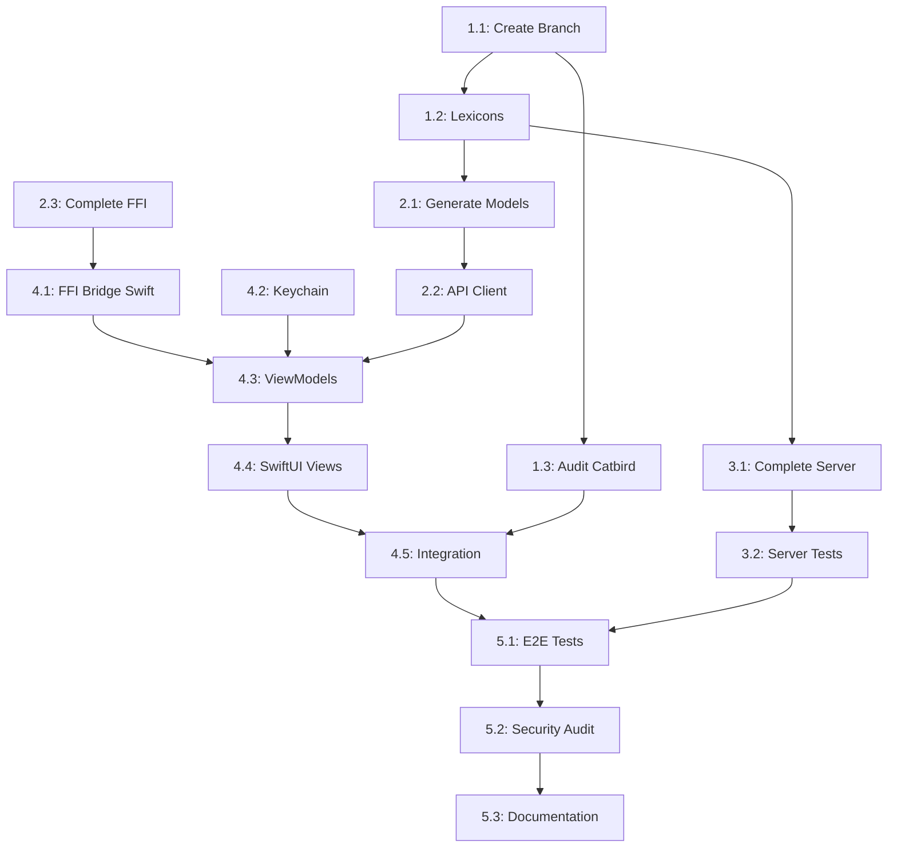

# MLS Chat Integration Master Plan
**Project**: Catbird MLS E2EE Group Chat Integration  
**Date**: October 21, 2025  
**Status**: Planning Phase

---

## Executive Summary

**Goal**: Fork Catbird iOS app into `mls-chat` branch, integrate MLS-based E2EE group chat alongside existing Bluesky chat, with complete lexicon definitions, model generation via Petrel, and production-ready server implementation.

**Approach**: Parallel agentic workflows coordinated by a master specification, with clear dependency chains and parallelizable tasks.

---

## Project Structure

```
Catbird+Petrel/
├── Catbird/                    # Main iOS app (to fork)
│   └── [mls-chat branch]       # New feature branch
├── mls/                        # Current MLS backend
│   ├── server/                 # Rust backend (enhance)
│   ├── mls-ffi/                # FFI library (complete)
│   ├── lexicon/                # Lexicon definitions (expand)
│   └── client-ios/             # Reference implementation
└── Petrel/                     # Code generator (assumed exists)
```

---

## Phase 1: Preparation & Infrastructure (Days 1-2)

### Task 1.1: Create Feature Branch
**Agent**: Git Coordinator  
**Dependencies**: None  
**Parallelizable**: No (foundational)

```bash
cd /Users/joshlacalamito/Developer/Catbird+Petrel/Catbird
git checkout -b mls-chat
git push -u origin mls-chat
```

**Deliverables**:
- ✓ `mls-chat` branch created
- ✓ Branch protection rules configured
- ✓ Initial commit with plan documentation

---

### Task 1.2: Complete Lexicon Definitions
**Agent**: Lexicon Architect  
**Dependencies**: None  
**Parallelizable**: Yes (with 1.1 after branch creation)

**Location**: `mls/lexicon/`

**Files to Create/Expand**:

1. **blue.catbird.mls.defs.json** (common types)
   - `convoView` - conversation metadata
   - `messageView` - message envelope
   - `memberView` - participant info
   - `keyPackageRef` - KeyPackage reference
   - `blobRef` - attachment reference
   - `epochInfo` - MLS epoch metadata

2. **blue.catbird.mls.createConvo.json**
   - Input: `{ title?, didList?, cipherSuite? }`
   - Output: `convoView`

3. **blue.catbird.mls.addMembers.json**
   - Input: `{ convoId, didList, commit?, welcome? }`
   - Output: `{ success, newEpoch, status }`

4. **blue.catbird.mls.sendMessage.json**
   - Input: `{ convoId, ciphertext, epoch, senderDid }`
   - Output: `{ messageId, receivedAt }`

5. **blue.catbird.mls.getMessages.json** (query)
   - Params: `{ convoId, sinceMessage?, sinceEpoch? }`
   - Output: `{ messages: messageView[] }`

6. **blue.catbird.mls.leaveConvo.json**
   - Input: `{ convoId, targetDid?, commit? }`
   - Output: `{ success, newEpoch }`

7. **blue.catbird.mls.publishKeyPackage.json**
   - Input: `{ keyPackage (base64), cipherSuite, expiresAt }`
   - Output: `{ success }`

8. **blue.catbird.mls.getKeyPackages.json** (query)
   - Params: `{ dids[] }`
   - Output: `{ keyPackages: { did, keyPackage, cipherSuite }[] }`

9. **blue.catbird.mls.uploadBlob.json**
   - Input: `{ blob (base64), mimeType }`
   - Output: `{ blobRef (cid, size, mimeType) }`

10. **blue.catbird.mls.getConvos.json** (query)
    - Params: `{ sinceUpdate? }`
    - Output: `{ convos: convoView[] }`

**Validation**:
- All lexicons follow AT Protocol standards
- NSIDs use `blue.catbird.mls.*` namespace
- Procedures vs queries correctly designated
- Input/output schemas include all required fields
- Base64 encoding specified for binary data

**Deliverables**:
- ✓ 10 complete lexicon JSON files
- ✓ Validation against AT Protocol schema
- ✓ Documentation of field meanings
- ✓ Cipher suite enum definitions

---

### Task 1.3: Audit Existing Catbird Architecture
**Agent**: Code Archaeologist  
**Dependencies**: Task 1.1  
**Parallelizable**: Yes (with 1.2)

**Analysis Areas**:
1. Current chat implementation (Bluesky integration)
2. Petrel usage patterns and code generation
3. Existing models and view architecture
4. Networking layer (API clients)
5. Keychain/security implementations
6. SwiftData/persistence patterns
7. SwiftUI view hierarchies
8. Dependency injection patterns

**Files to Analyze**:
```
Catbird/
├── Catbird/
│   ├── Models/              # Data models
│   ├── Views/               # SwiftUI views
│   ├── Services/            # API clients
│   ├── ViewModels/          # Business logic
│   ├── Utilities/           # Helpers
│   └── Resources/           # Assets
└── Catbird.xcodeproj/
```

**Deliverables**:
- ✓ Architecture diagram (Mermaid)
- ✓ Dependency map
- ✓ Integration points document
- ✓ Reusable components list
- ✓ Risk assessment for conflicts

---

## Phase 2: Code Generation & Model Creation (Days 3-4)

### Task 2.1: Generate Swift Models via Petrel
**Agent**: Petrel Operator  
**Dependencies**: Task 1.2 (lexicons complete)  
**Parallelizable**: No (depends on lexicons)

**Input**: `mls/lexicon/*.json`  
**Output**: Swift model files in `Catbird/Models/MLS/`

**Command** (assumed):
```bash
cd /Users/joshlacalamito/Developer/Catbird+Petrel
petrel generate \
  --lexicon mls/lexicon \
  --output Catbird/Catbird/Models/MLS \
  --language swift \
  --namespace BlueCatbirdMLS
```

**Expected Generated Files**:
```
Catbird/Catbird/Models/MLS/
├── ConvoView.swift
├── MessageView.swift
├── MemberView.swift
├── KeyPackageRef.swift
├── BlobRef.swift
├── EpochInfo.swift
├── CreateConvoInput.swift
├── CreateConvoOutput.swift
├── AddMembersInput.swift
├── AddMembersOutput.swift
├── SendMessageInput.swift
├── SendMessageOutput.swift
├── GetMessagesParams.swift
├── GetMessagesOutput.swift
├── LeaveConvoInput.swift
├── LeaveConvoOutput.swift
├── PublishKeyPackageInput.swift
├── PublishKeyPackageOutput.swift
├── GetKeyPackagesParams.swift
├── GetKeyPackagesOutput.swift
├── UploadBlobInput.swift
├── UploadBlobOutput.swift
└── GetConvosOutput.swift
```

**Deliverables**:
- ✓ All models generated from lexicons
- ✓ Codable conformance for JSON serialization
- ✓ Proper namespacing to avoid conflicts
- ✓ Generated code compiles without errors
- ✓ Unit tests for model serialization

---

### Task 2.2: Create MLS API Client
**Agent**: Network Engineer  
**Dependencies**: Task 2.1  
**Parallelizable**: Partial (can draft in parallel)

**File**: `Catbird/Catbird/Services/MLSClient.swift`

**Interface**:
```swift
actor MLSClient {
    let baseURL: URL
    let session: URLSession
    private var authToken: String?
    
    // MARK: - Authentication
    func authenticate(did: String, jwt: String) async throws
    
    // MARK: - Conversations
    func createConvo(title: String?, invites: [String]?) async throws -> ConvoView
    func getConvos(since: Date?) async throws -> [ConvoView]
    func leaveConvo(_ convoId: String, target: String?, commit: Data?) async throws
    
    // MARK: - Members
    func addMembers(
        convoId: String, 
        dids: [String], 
        commit: Data?, 
        welcome: Data?
    ) async throws -> AddMembersOutput
    
    // MARK: - Messages
    func sendMessage(
        convoId: String, 
        ciphertext: Data, 
        epoch: Int
    ) async throws -> SendMessageOutput
    
    func getMessages(
        convoId: String, 
        since: String?, 
        sinceEpoch: Int?
    ) async throws -> [MessageView]
    
    // MARK: - Key Management
    func publishKeyPackage(
        _ keyPackage: Data, 
        cipherSuite: String, 
        expires: Date
    ) async throws
    
    func getKeyPackages(dids: [String]) async throws -> [KeyPackageRef]
    
    // MARK: - Attachments
    func uploadBlob(_ data: Data, mimeType: String) async throws -> BlobRef
    func downloadBlob(cid: String) async throws -> Data
}
```

**Features**:
- Async/await API
- Automatic retry with exponential backoff
- Request/response logging (redacted)
- Error mapping from HTTP to domain errors
- Bearer token authentication
- JSON encoding/decoding with generated models

**Deliverables**:
- ✓ Complete MLSClient implementation
- ✓ Unit tests with mocked responses
- ✓ Integration tests against local server
- ✓ Error handling for all failure modes
- ✓ Documentation comments

---

### Task 2.3: Complete OpenMLS FFI Implementation
**Agent**: Cryptography Specialist  
**Dependencies**: None (parallel to 2.1-2.2)  
**Parallelizable**: Yes

**File**: `mls/mls-ffi/src/lib.rs`

**Functions to Implement**:

1. **mls_create_group**
   ```rust
   #[no_mangle]
   pub extern "C" fn mls_create_group(
       credential: *const u8, credential_len: usize,
       cipher_suite: u16,
       out_group_id: *mut u8, out_group_id_len: *mut usize,
       out_error: *mut *mut c_char
   ) -> *mut c_void  // Returns opaque MlsGroup handle
   ```

2. **mls_join_group**
   ```rust
   #[no_mangle]
   pub extern "C" fn mls_join_group(
       welcome: *const u8, welcome_len: usize,
       credential: *const u8, credential_len: usize,
       out_group_id: *mut u8, out_group_id_len: *mut usize,
       out_error: *mut *mut c_char
   ) -> *mut c_void
   ```

3. **mls_add_member**
   ```rust
   #[no_mangle]
   pub extern "C" fn mls_add_member(
       group: *mut c_void,
       key_package: *const u8, key_package_len: usize,
       out_commit: *mut u8, out_commit_len: *mut usize,
       out_welcome: *mut u8, out_welcome_len: *mut usize,
       out_error: *mut *mut c_char
   ) -> i32  // Status code
   ```

4. **mls_encrypt_message**
   ```rust
   #[no_mangle]
   pub extern "C" fn mls_encrypt_message(
       group: *mut c_void,
       plaintext: *const u8, plaintext_len: usize,
       out_ciphertext: *mut u8, out_ciphertext_len: *mut usize,
       out_error: *mut *mut c_char
   ) -> i32
   ```

5. **mls_decrypt_message**
   ```rust
   #[no_mangle]
   pub extern "C" fn mls_decrypt_message(
       group: *mut c_void,
       ciphertext: *const u8, ciphertext_len: usize,
       out_plaintext: *mut u8, out_plaintext_len: *mut usize,
       out_sender_index: *mut u32,
       out_error: *mut *mut c_char
   ) -> i32
   ```

6. **mls_remove_member / mls_process_commit / mls_current_epoch**

**Implementation Notes**:
- Use OpenMLS `MlsGroup`, `KeyPackage`, `MlsMessageIn/Out`
- Proper memory management (Rust Box for handles)
- Thread-safe if needed (Mutex/RwLock)
- Comprehensive error messages
- cbindgen header generation

**Testing**:
- Unit tests in Rust for each function
- Integration tests simulating multi-party group
- Memory leak testing with Valgrind/Instruments

**Deliverables**:
- ✓ All FFI functions implemented
- ✓ Generated C header file
- ✓ Rust tests passing
- ✓ Memory safety verified
- ✓ iOS integration testable

---

## Phase 3: Server Enhancement (Days 5-7)

### Task 3.1: Complete Server Implementation
**Agent**: Backend Engineer  
**Dependencies**: Task 1.2 (lexicons)  
**Parallelizable**: Partial (with 2.3)

**Files**: `mls/server/src/`

**Sub-tasks**:

**3.1.1: Authentication Enhancement**
- Full JWT verification (not just bearer DID)
- DID document fetching and caching
- Signature verification with Ed25519
- Session management (Redis/in-memory)
- Rate limiting per DID

**3.1.2: Storage Layer**
- PostgreSQL schema migrations (sqlx)
- Proper indexing for queries
- Foreign key constraints
- Transactions for consistency
- Prepared statements

**Schema**:
```sql
CREATE TABLE users (
    did TEXT PRIMARY KEY,
    handle TEXT,
    last_seen TIMESTAMP,
    created_at TIMESTAMP DEFAULT NOW()
);

CREATE TABLE conversations (
    id UUID PRIMARY KEY,
    creator_did TEXT REFERENCES users(did),
    title TEXT,
    cipher_suite TEXT NOT NULL,
    current_epoch INTEGER NOT NULL DEFAULT 0,
    created_at TIMESTAMP DEFAULT NOW()
);

CREATE TABLE memberships (
    convo_id UUID REFERENCES conversations(id) ON DELETE CASCADE,
    member_did TEXT REFERENCES users(did),
    joined_at TIMESTAMP DEFAULT NOW(),
    left_at TIMESTAMP,
    unread_count INTEGER DEFAULT 0,
    PRIMARY KEY (convo_id, member_did)
);

CREATE TABLE messages (
    id UUID PRIMARY KEY,
    convo_id UUID REFERENCES conversations(id) ON DELETE CASCADE,
    sender_did TEXT REFERENCES users(did),
    type TEXT NOT NULL, -- 'app' or 'commit'
    epoch INTEGER NOT NULL,
    ciphertext BYTEA NOT NULL,
    sent_at TIMESTAMP DEFAULT NOW()
);

CREATE INDEX idx_messages_convo_time ON messages(convo_id, sent_at);
CREATE INDEX idx_messages_epoch ON messages(convo_id, epoch);

CREATE TABLE key_packages (
    did TEXT REFERENCES users(did),
    cipher_suite TEXT NOT NULL,
    key_data BYTEA NOT NULL,
    created_at TIMESTAMP DEFAULT NOW(),
    expires_at TIMESTAMP NOT NULL,
    consumed BOOLEAN DEFAULT FALSE,
    PRIMARY KEY (did, cipher_suite, created_at)
);

CREATE TABLE blobs (
    cid TEXT PRIMARY KEY,
    data BYTEA NOT NULL,
    size INTEGER NOT NULL,
    mime_type TEXT,
    uploaded_by TEXT REFERENCES users(did),
    convo_id UUID REFERENCES conversations(id),
    uploaded_at TIMESTAMP DEFAULT NOW()
);

CREATE TABLE welcomes (
    convo_id UUID REFERENCES conversations(id),
    target_did TEXT REFERENCES users(did),
    welcome_data BYTEA NOT NULL,
    created_at TIMESTAMP DEFAULT NOW(),
    consumed BOOLEAN DEFAULT FALSE,
    PRIMARY KEY (convo_id, target_did)
);
```

**3.1.3: Handler Completion**
- Implement all TODOs in handlers.rs
- Add validation logic (epoch consistency, membership checks)
- Proper error responses (HTTP status codes)
- Request logging (structured, redacted)

**3.1.4: KeyPackage Management**
- Rotation logic (auto-generate on depletion)
- Expiration checking
- Cipher suite validation
- One-time use enforcement

**3.1.5: Blob Storage**
- Content-addressed storage (SHA-256 CID)
- Integrity verification
- Size limits (configurable)
- Optional external storage (S3-compatible)

**Deliverables**:
- ✓ Complete server with all endpoints
- ✓ Database migrations
- ✓ 90%+ test coverage
- ✓ Performance benchmarks
- ✓ Docker image
- ✓ Deployment documentation

---

### Task 3.2: Testing Infrastructure
**Agent**: QA Engineer  
**Dependencies**: Task 3.1  
**Parallelizable**: Partial (can draft tests early)

**Test Types**:

1. **Unit Tests** (per module)
2. **Integration Tests** (API endpoints)
3. **Multi-party MLS Harness** (2-10 clients)
4. **Load Tests** (100+ concurrent users)
5. **Security Tests** (OWASP Top 10)

**Multi-party Harness**:
```rust
// mls/server/tests/multiparty_test.rs
#[tokio::test]
async fn test_three_member_group_with_removal() {
    let server = spawn_test_server().await;
    let alice = TestClient::new("did:plc:alice");
    let bob = TestClient::new("did:plc:bob");
    let charlie = TestClient::new("did:plc:charlie");
    
    // Alice creates group
    let convo_id = alice.create_convo(None).await.unwrap();
    
    // Alice invites Bob
    let bob_kp = bob.publish_key_package().await.unwrap();
    alice.add_member(convo_id, bob.did, bob_kp).await.unwrap();
    
    // Bob joins via Welcome
    bob.join_convo(convo_id).await.unwrap();
    
    // Alice invites Charlie
    let charlie_kp = charlie.publish_key_package().await.unwrap();
    alice.add_member(convo_id, charlie.did, charlie_kp).await.unwrap();
    charlie.join_convo(convo_id).await.unwrap();
    
    // All send messages (epoch 2)
    alice.send(convo_id, "Hello from Alice").await.unwrap();
    bob.send(convo_id, "Hello from Bob").await.unwrap();
    charlie.send(convo_id, "Hello from Charlie").await.unwrap();
    
    // All receive and decrypt
    assert_eq!(bob.recv_all(convo_id).await.len(), 3);
    
    // Alice removes Charlie (epoch 3)
    alice.remove_member(convo_id, charlie.did).await.unwrap();
    
    // Alice sends message (epoch 3)
    alice.send(convo_id, "Charlie is gone").await.unwrap();
    
    // Bob can decrypt, Charlie cannot
    assert!(bob.recv_all(convo_id).await.last().unwrap().plaintext == "Charlie is gone");
    assert!(charlie.recv_all(convo_id).await.is_err()); // Unauthorized
}
```

**Deliverables**:
- ✓ 50+ integration tests
- ✓ Multi-party harness with 10+ scenarios
- ✓ Load test showing 1000 msg/sec throughput
- ✓ Security scan report (no critical vulns)
- ✓ CI/CD pipeline configured

---

## Phase 4: iOS Integration (Days 8-12)

### Task 4.1: FFI Bridge (Swift)
**Agent**: FFI Specialist  
**Dependencies**: Task 2.3 (Rust FFI complete)  
**Parallelizable**: No

**File**: `Catbird/Catbird/Services/MLS/MLSManager.swift`

**Implementation**:
```swift
import Foundation

/// Swift wrapper around Rust MLS FFI
@MainActor
class MLSManager {
    private var groupHandles: [String: OpaquePointer] = [:]
    
    // MARK: - Group Lifecycle
    
    func createGroup(credential: Data, cipherSuite: CipherSuite) throws -> MLSGroupSession {
        var groupIdBuffer = [UInt8](repeating: 0, count: 32)
        var groupIdLen: Int = 32
        var error: UnsafeMutablePointer<CChar>?
        
        let handle = credential.withUnsafeBytes { credPtr in
            mls_create_group(
                credPtr.baseAddress?.assumingMemoryBound(to: UInt8.self),
                credential.count,
                cipherSuite.rawValue,
                &groupIdBuffer,
                &groupIdLen,
                &error
            )
        }
        
        if let error = error {
            let message = String(cString: error)
            mls_free_error(error)
            throw MLSError.operationFailed(message)
        }
        
        guard let handle = handle else {
            throw MLSError.operationFailed("Failed to create group")
        }
        
        let groupId = Data(groupIdBuffer.prefix(groupIdLen))
        let session = MLSGroupSession(groupId: groupId, handle: handle, epoch: 0)
        groupHandles[groupId.base64EncodedString()] = handle
        return session
    }
    
    func joinGroup(welcome: Data, credential: Data) throws -> MLSGroupSession {
        // Similar pattern...
    }
    
    func addMember(
        session: MLSGroupSession, 
        keyPackage: Data
    ) throws -> (commit: Data, welcome: Data) {
        var commitBuffer = [UInt8](repeating: 0, count: 8192)
        var commitLen: Int = 8192
        var welcomeBuffer = [UInt8](repeating: 0, count: 8192)
        var welcomeLen: Int = 8192
        var error: UnsafeMutablePointer<CChar>?
        
        let status = keyPackage.withUnsafeBytes { kpPtr in
            mls_add_member(
                session.handle,
                kpPtr.baseAddress?.assumingMemoryBound(to: UInt8.self),
                keyPackage.count,
                &commitBuffer,
                &commitLen,
                &welcomeBuffer,
                &welcomeLen,
                &error
            )
        }
        
        if status != 0 {
            if let error = error {
                let message = String(cString: error)
                mls_free_error(error)
                throw MLSError.operationFailed(message)
            }
            throw MLSError.operationFailed("Add member failed")
        }
        
        return (
            commit: Data(commitBuffer.prefix(commitLen)),
            welcome: Data(welcomeBuffer.prefix(welcomeLen))
        )
    }
    
    func encrypt(session: MLSGroupSession, plaintext: Data) throws -> Data {
        // ...
    }
    
    func decrypt(session: MLSGroupSession, ciphertext: Data) throws -> (plaintext: Data, senderIndex: UInt32) {
        // ...
    }
    
    deinit {
        for handle in groupHandles.values {
            mls_free_group(handle)
        }
    }
}

struct MLSGroupSession {
    let groupId: Data
    let handle: OpaquePointer
    var epoch: Int
}

enum MLSError: Error {
    case operationFailed(String)
    case invalidState
    case keyNotFound
}
```

**Deliverables**:
- ✓ Complete FFI wrapper
- ✓ Memory safety verified
- ✓ Unit tests with mock FFI
- ✓ Integration tests with real Rust lib
- ✓ Documentation

---

### Task 4.2: Keychain & Storage
**Agent**: Security Engineer  
**Dependencies**: None  
**Parallelizable**: Yes (with 4.1)

**Files**:
- `Catbird/Catbird/Services/MLS/KeychainManager.swift`
- `Catbird/Catbird/Services/MLS/MLSStorage.swift`

**KeychainManager**:
```swift
actor KeychainManager {
    func storeCredential(_ credential: Data, for did: String) async throws
    func retrieveCredential(for did: String) async throws -> Data
    func storeGroupState(_ state: Data, for groupId: String) async throws
    func retrieveGroupState(for groupId: String) async throws -> Data?
    func deleteGroupState(for groupId: String) async throws
}
```

**MLSStorage** (SwiftData):
```swift
import SwiftData

@Model
class MLSConversation {
    @Attribute(.unique) var id: String
    var title: String?
    var members: [String] // DIDs
    var currentEpoch: Int
    var lastUpdate: Date
    var unreadCount: Int
    
    @Relationship(deleteRule: .cascade) var messages: [MLSMessage]
}

@Model
class MLSMessage {
    @Attribute(.unique) var id: String
    var conversationId: String
    var senderDid: String
    var plaintext: String
    var sentAt: Date
    var epoch: Int
    var isOutgoing: Bool
}
```

**Deliverables**:
- ✓ Keychain operations
- ✓ SwiftData models
- ✓ Migration from old schema (if applicable)
- ✓ Encryption at rest
- ✓ Unit tests

---

### Task 4.3: View Models & Business Logic
**Agent**: iOS Developer  
**Dependencies**: Tasks 2.2, 4.1, 4.2  
**Parallelizable**: Partial

**Files**:
- `Catbird/Catbird/ViewModels/MLSConversationListViewModel.swift`
- `Catbird/Catbird/ViewModels/MLSConversationViewModel.swift`

**MLSConversationListViewModel**:
```swift
@MainActor
class MLSConversationListViewModel: ObservableObject {
    @Published var conversations: [MLSConversation] = []
    @Published var isLoading = false
    @Published var error: Error?
    
    private let client: MLSClient
    private let storage: MLSStorage
    
    func loadConversations() async {
        isLoading = true
        defer { isLoading = false }
        
        do {
            let remote = try await client.getConvos(since: nil)
            let local = await storage.fetchConversations()
            
            // Merge remote and local
            conversations = mergeConversations(remote: remote, local: local)
        } catch {
            self.error = error
        }
    }
    
    func createConversation(title: String, invites: [String]) async throws {
        let convo = try await client.createConvo(title: title, invites: invites)
        await storage.save(convo)
        conversations.append(convo)
    }
}
```

**MLSConversationViewModel**:
```swift
@MainActor
class MLSConversationViewModel: ObservableObject {
    @Published var messages: [MLSMessage] = []
    @Published var isSending = false
    
    let conversation: MLSConversation
    private let client: MLSClient
    private let mlsManager: MLSManager
    private var groupSession: MLSGroupSession?
    
    func loadMessages() async {
        // Fetch from server, decrypt, store locally
    }
    
    func send(text: String) async throws {
        guard let session = groupSession else { throw MLSError.invalidState }
        
        // Encrypt
        let plaintext = text.data(using: .utf8)!
        let ciphertext = try mlsManager.encrypt(session: session, plaintext: plaintext)
        
        // Send to server
        let result = try await client.sendMessage(
            convoId: conversation.id,
            ciphertext: ciphertext,
            epoch: session.epoch
        )
        
        // Store locally
        let message = MLSMessage(
            id: result.messageId,
            conversationId: conversation.id,
            senderDid: "me",
            plaintext: text,
            sentAt: result.receivedAt,
            epoch: session.epoch,
            isOutgoing: true
        )
        messages.append(message)
    }
    
    func invite(did: String) async throws {
        // Fetch keypackage, call mlsManager.addMember, send to server
    }
}
```

**Deliverables**:
- ✓ All view models
- ✓ Sync logic (polling or WebSocket)
- ✓ Error handling and retry
- ✓ Offline support
- ✓ Unit tests with mocked dependencies

---

### Task 4.4: SwiftUI Views
**Agent**: UI Developer  
**Dependencies**: Task 4.3  
**Parallelizable**: Partial (can design in parallel)

**Files**:
- `Catbird/Catbird/Views/MLS/MLSConversationListView.swift`
- `Catbird/Catbird/Views/MLS/MLSConversationView.swift`
- `Catbird/Catbird/Views/MLS/MLSMessageRow.swift`
- `Catbird/Catbird/Views/MLS/MLSMemberPickerView.swift`

**MLSConversationListView**:
```swift
struct MLSConversationListView: View {
    @StateObject private var viewModel = MLSConversationListViewModel()
    @State private var showingNewConvo = false
    
    var body: some View {
        List {
            ForEach(viewModel.conversations) { convo in
                NavigationLink(destination: MLSConversationView(conversation: convo)) {
                    MLSConversationRow(conversation: convo)
                }
            }
        }
        .navigationTitle("Encrypted Chats")
        .toolbar {
            Button(action: { showingNewConvo = true }) {
                Image(systemName: "plus")
            }
        }
        .sheet(isPresented: $showingNewConvo) {
            NewMLSConversationView()
        }
        .task {
            await viewModel.loadConversations()
        }
    }
}
```

**MLSConversationView**:
```swift
struct MLSConversationView: View {
    @StateObject private var viewModel: MLSConversationViewModel
    @State private var messageText = ""
    
    init(conversation: MLSConversation) {
        _viewModel = StateObject(wrappedValue: MLSConversationViewModel(conversation: conversation))
    }
    
    var body: some View {
        VStack {
            ScrollView {
                LazyVStack {
                    ForEach(viewModel.messages) { message in
                        MLSMessageRow(message: message)
                    }
                }
            }
            
            HStack {
                TextField("Message", text: $messageText)
                    .textFieldStyle(.roundedBorder)
                
                Button("Send") {
                    Task {
                        try await viewModel.send(text: messageText)
                        messageText = ""
                    }
                }
                .disabled(messageText.isEmpty || viewModel.isSending)
            }
            .padding()
        }
        .navigationTitle(viewModel.conversation.title ?? "Group Chat")
        .task {
            await viewModel.loadMessages()
        }
    }
}
```

**Design Considerations**:
- Match existing Catbird aesthetic
- Encrypted indicator (lock icon)
- Member list view
- Invite flow
- Attachment picker
- Error states

**Deliverables**:
- ✓ All views implemented
- ✓ Accessibility support
- ✓ Dark mode support
- ✓ Localization ready
- ✓ Screenshots for App Store

---

### Task 4.5: Integration with Existing Catbird
**Agent**: Integration Specialist  
**Dependencies**: Tasks 4.1-4.4  
**Parallelizable**: No

**Integration Points**:

1. **Navigation**
   - Add "MLS Chats" tab or section
   - Deep linking support
   - Notifications routing

2. **Settings**
   - MLS server endpoint configuration
   - Key management UI
   - Debug options (epoch display, etc.)

3. **Onboarding**
   - Initial key generation
   - KeyPackage publication
   - Server connection test

4. **Coexistence with Bluesky Chat**
   - Separate data models
   - Separate API clients
   - Unified notification handling
   - Possibly unified chat list (with badges)

**Files to Modify**:
- `Catbird/Catbird/App/CatbirdApp.swift` (app initialization)
- `Catbird/Catbird/Views/MainTabView.swift` (add MLS tab)
- `Catbird/Catbird/Services/NotificationManager.swift` (route MLS notifications)

**Deliverables**:
- ✓ Full integration without breaking existing features
- ✓ A/B testing flag to enable/disable MLS
- ✓ Migration path for beta users
- ✓ Regression tests (existing features still work)

---

## Phase 5: End-to-End Testing & Polish (Days 13-14)

### Task 5.1: E2E Testing
**Agent**: QA Team  
**Dependencies**: All Phase 4 tasks  
**Parallelizable**: No

**Test Scenarios**:
1. Alice creates group, invites Bob, both exchange messages
2. Alice adds Charlie to existing conversation
3. Bob leaves voluntarily
4. Alice removes compromised device (Charlie)
5. Offline/online sync (Alice offline, receives 10 messages on reconnect)
6. Attachment send/receive
7. Concurrent sends from multiple members
8. Key rotation after 24 hours
9. Server restart mid-conversation
10. Network failure handling

**Tools**:
- XCTest for iOS tests
- Simulator farm (iOS 17.0, 17.5, 18.0)
- Charles Proxy for network simulation
- TestFlight for beta distribution

**Deliverables**:
- ✓ 30+ E2E test cases
- ✓ All passing on CI
- ✓ Performance profiling (no memory leaks, smooth 60fps)
- ✓ Battery impact assessment

---

### Task 5.2: Security Audit
**Agent**: Security Auditor  
**Dependencies**: All implementation complete  
**Parallelizable**: Yes (with 5.1)

**Audit Areas**:
1. Cryptographic implementation review
2. Key storage security
3. Network security (TLS pinning?)
4. Input validation
5. Injection vulnerabilities
6. Log sanitization
7. Privacy compliance (GDPR, CCPA)

**Tools**:
- Static analysis (SwiftLint, Semgrep)
- Dynamic analysis (Frida, debugger)
- Dependency audit (cargo audit, Dependabot)
- Penetration testing (manual + automated)

**Deliverables**:
- ✓ Security audit report
- ✓ All critical/high issues fixed
- ✓ Threat model validation
- ✓ Compliance checklist

---

### Task 5.3: Documentation & Deployment
**Agent**: Tech Writer & DevOps  
**Dependencies**: All tasks  
**Parallelizable**: Partial

**Documentation**:
1. User guide (screenshots, common flows)
2. Developer guide (architecture, extending)
3. Deployment guide (Docker, Kubernetes)
4. API reference (generated from code)
5. Security whitepaper
6. FAQ

**Deployment**:
1. Docker image with health checks
2. Helm chart for Kubernetes
3. Terraform/Pulumi for infrastructure
4. CI/CD pipeline (GitHub Actions)
5. Monitoring setup (Prometheus + Grafana)
6. Log aggregation (Loki or similar)

**Deliverables**:
- ✓ Complete documentation site
- ✓ Production deployment artifacts
- ✓ Runbook for operators
- ✓ Incident response plan

---

## Dependency Graph (Mermaid)



---

## Agentic Workflow Specification

### Agent Definitions

**Agent 1: Lexicon Architect**
- **Responsibility**: Define and validate all AT Protocol lexicon files
- **Skills**: JSON schema, AT Protocol standards, API design
- **Tools**: JSON validator, lexicon linter
- **Output**: 10 validated lexicon JSON files

**Agent 2: Petrel Operator**
- **Responsibility**: Generate Swift models from lexicons
- **Skills**: Code generation, Swift syntax
- **Tools**: Petrel CLI, Swift compiler
- **Output**: 20+ Swift model files

**Agent 3: Network Engineer**
- **Responsibility**: Implement MLSClient (Swift)
- **Skills**: Swift async/await, URLSession, error handling
- **Tools**: Xcode, network mocking frameworks
- **Output**: Complete network client with tests

**Agent 4: Cryptography Specialist**
- **Responsibility**: Complete OpenMLS FFI implementation
- **Skills**: Rust, OpenMLS, FFI, memory safety
- **Tools**: Rust toolchain, cbindgen, Valgrind
- **Output**: Production-ready FFI library

**Agent 5: Backend Engineer**
- **Responsibility**: Complete and harden server implementation
- **Skills**: Rust, Axum, PostgreSQL, authentication
- **Tools**: cargo, sqlx-cli, Docker
- **Output**: Production server with migrations and tests

**Agent 6: QA Engineer**
- **Responsibility**: Comprehensive testing infrastructure
- **Skills**: Integration testing, load testing, test automation
- **Tools**: Rust test harness, Apache Bench, k6
- **Output**: Multi-party MLS test suite, load tests

**Agent 7: FFI Specialist**
- **Responsibility**: Swift FFI bridge to Rust
- **Skills**: Swift, Objective-C interop, memory management
- **Tools**: Xcode, Instruments
- **Output**: MLSManager with safe FFI wrappers

**Agent 8: Security Engineer**
- **Responsibility**: Keychain integration and secure storage
- **Skills**: iOS Keychain, SwiftData, encryption
- **Tools**: Xcode, Security framework
- **Output**: KeychainManager and MLSStorage

**Agent 9: iOS Developer**
- **Responsibility**: ViewModels and business logic
- **Skills**: SwiftUI, Combine, async patterns
- **Tools**: Xcode, Swift testing
- **Output**: All view models with unit tests

**Agent 10: UI Developer**
- **Responsibility**: SwiftUI views
- **Skills**: SwiftUI, UIKit, accessibility
- **Tools**: Xcode, SF Symbols, design tools
- **Output**: Complete MLS chat UI

**Agent 11: Integration Specialist**
- **Responsibility**: Integrate MLS into existing Catbird
- **Skills**: iOS architecture, feature flags, migration
- **Tools**: Xcode, Git
- **Output**: Seamless coexistence with Bluesky chat

**Agent 12: Security Auditor**
- **Responsibility**: Security review and penetration testing
- **Skills**: Cryptography, security testing, compliance
- **Tools**: Static analyzers, Frida, manual testing
- **Output**: Security audit report with fixes

**Agent 13: Tech Writer**
- **Responsibility**: Documentation
- **Skills**: Technical writing, diagramming
- **Tools**: Markdown, Mermaid, MkDocs
- **Output**: Complete documentation site

**Agent 14: DevOps Engineer**
- **Responsibility**: Deployment automation
- **Skills**: Docker, Kubernetes, CI/CD
- **Tools**: GitHub Actions, Terraform
- **Output**: Production deployment pipeline

---

## Coordination Protocol

### Master Controller
- Tracks completion of all tasks
- Resolves dependency conflicts
- Assigns agents to tasks
- Reviews deliverables
- Approves phase transitions

### Communication
- Daily standup (async status updates)
- Blockers reported immediately
- Artifacts committed to Git with PR review
- Integration points tested at boundaries

### Quality Gates
1. **Lexicons**: Must validate against AT Protocol schema
2. **Generated Code**: Must compile without errors
3. **Tests**: Must achieve 80%+ coverage
4. **Security**: No critical vulnerabilities
5. **Performance**: <100ms P95 API latency
6. **UI**: Must pass accessibility audit

---

## Timeline Summary

| Phase | Duration | Parallelization | Deliverable |
|-------|----------|-----------------|-------------|
| 1. Preparation | 2 days | High (3 agents) | Branch + Lexicons + Audit |
| 2. Code Gen | 2 days | Medium (3 agents) | Models + Clients + FFI |
| 3. Server | 3 days | Medium (2 agents) | Production Server |
| 4. iOS Integration | 5 days | Low (sequential) | Complete iOS App |
| 5. Testing & Polish | 2 days | Medium (3 agents) | Production Ready |

**Total**: 14 calendar days with proper parallelization

---

## Risk Mitigation

| Risk | Probability | Impact | Mitigation |
|------|-------------|--------|------------|
| Petrel generator issues | Medium | High | Manual model creation fallback |
| OpenMLS API changes | Low | High | Pin to specific version |
| iOS/Catbird conflicts | Medium | Medium | Feature flag, gradual rollout |
| Performance issues | Medium | Medium | Early load testing |
| Security vulnerabilities | Low | Critical | External audit, bug bounty |
| Timeline slippage | High | Medium | Buffer in each phase |

---

## Success Criteria

### Functional
- ✓ Create group with 3+ members
- ✓ Send/receive encrypted messages
- ✓ Invite new members asynchronously
- ✓ Remove members (PCS demonstrated)
- ✓ Attachments work
- ✓ Offline sync works

### Non-Functional
- ✓ No plaintext in server logs
- ✓ KeyPackages in DID docs or server
- ✓ <200ms message send latency
- ✓ 99.9% uptime
- ✓ Passes security audit
- ✓ Existing Catbird features unaffected

### Acceptance
- ✓ All automated tests pass
- ✓ Manual QA sign-off
- ✓ Security audit complete
- ✓ Documentation published
- ✓ Beta deployment successful

---

## Next Steps

1. **Review and approve this plan**
2. **Assign agents to initial tasks**
3. **Create GitHub project with all tasks**
4. **Set up communication channels**
5. **Kickoff Phase 1**

---

**Document Status**: Draft v1.0  
**Last Updated**: October 21, 2025  
**Owner**: Project Lead  
**Approvers**: Engineering, Product, Security
