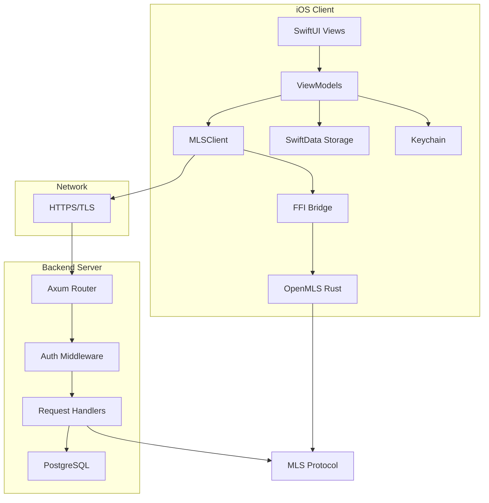
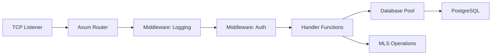

# MLS Chat Developer Guide

**Version**: 1.0  
**Last Updated**: October 21, 2025  
**Audience**: iOS Developers, Backend Engineers, Contributors

---

## 📖 Table of Contents

1. [Architecture Overview](#architecture-overview)
2. [Getting Started](#getting-started)
3. [API Reference](#api-reference)
4. [iOS Client Development](#ios-client-development)
5. [Backend Development](#backend-development)
6. [FFI Bridge](#ffi-bridge)
7. [Testing](#testing)
8. [Extending Functionality](#extending-functionality)
9. [Common Patterns](#common-patterns)
10. [Troubleshooting](#troubleshooting)

---

## 🏗️ Architecture Overview

### System Components



### Technology Stack

| Layer | Technology | Purpose |
|-------|------------|---------|
| **iOS UI** | SwiftUI | Native iOS interface |
| **iOS Logic** | Swift 5.9+ | Business logic, networking |
| **Crypto** | Rust (OpenMLS) | MLS protocol implementation |
| **FFI** | Swift-Rust bridge | Call Rust from Swift |
| **Network** | URLSession/Alamofire | HTTP client |
| **Storage** | SwiftData + Keychain | Local persistence |
| **Backend** | Rust (Axum) | HTTP server |
| **Database** | PostgreSQL | Message storage |
| **Identity** | AT Protocol | DID authentication |

---

## 🚀 Getting Started

### Prerequisites

```bash
# macOS Tools
xcode-select --install
brew install rust swiftlint

# Rust toolchain
rustup target add aarch64-apple-ios aarch64-apple-ios-sim

# iOS development
# - Xcode 15.0+
# - iOS 16.0+ deployment target
```

### Clone & Build

```bash
# Clone repository
cd /Users/joshlacalamito/Developer/Catbird+Petrel
git clone <repo-url> mls
cd mls

# Build Rust FFI
cd mls-ffi
cargo build --release
cargo build --release --target aarch64-apple-ios

# Generate Swift bindings
cbindgen --config cbindgen.toml --output ../client-ios/CatbirdChat/MLSBridge.h

# Build server
cd ../server
cargo build --release
cargo test

# Run server locally
cargo run
# Server starts on http://localhost:3000
```

### Project Structure

```
mls/
├── server/                 # Rust backend
│   ├── src/
│   │   ├── main.rs        # Entry point, routes
│   │   ├── handlers/      # XRPC endpoint handlers
│   │   ├── auth.rs        # JWT/DID authentication
│   │   ├── db.rs          # Database connection
│   │   ├── models.rs      # Data models
│   │   └── storage.rs     # Blob storage
│   ├── migrations/        # SQL migrations
│   └── tests/             # Integration tests
│
├── mls-ffi/               # Rust FFI bridge
│   ├── src/
│   │   ├── lib.rs         # FFI exports
│   │   ├── ffi.rs         # C-compatible API
│   │   ├── mls_context.rs # MLS group management
│   │   └── error.rs       # Error handling
│   └── cbindgen.toml      # Swift header generation
│
├── client-ios/            # iOS reference client
│   └── CatbirdChat/
│       ├── Models/        # Swift models
│       ├── Services/      # MLSClient, networking
│       ├── ViewModels/    # MVVM view models
│       ├── Views/         # SwiftUI views
│       └── MLSBridge.h    # Generated FFI header
│
├── lexicon/               # AT Protocol schemas
│   ├── blue.catbird.mls.*.json
│   └── LEXICON_README.md
│
└── docs/                  # Documentation
    ├── ARCHITECTURE.md
    ├── SECURITY.md
    └── USER_GUIDE.md
```

---

## 🔌 API Reference

### XRPC Endpoints

All endpoints are under `/xrpc/blue.catbird.mls.*` namespace.

#### 1. `createConvo` - Create Group

**Request:**
```json
{
  "conversationId": "did:plc:abc123...",
  "members": ["did:plc:user1", "did:plc:user2"],
  "welcomeMessages": ["<encrypted_welcome_1>", "<encrypted_welcome_2>"]
}
```

**Response:**
```json
{
  "conversationId": "did:plc:abc123...",
  "epoch": 0,
  "createdAt": "2025-10-21T12:00:00Z"
}
```

**Errors:**
- `InvalidRequest` - Missing required fields
- `MemberNotFound` - No KeyPackages for member
- `Unauthorized` - Invalid bearer token

---

#### 2. `addMembers` - Invite to Group

**Request:**
```json
{
  "conversationId": "did:plc:abc123...",
  "commit": "<mls_commit_bytes>",
  "welcomeMessages": ["<encrypted_welcome_1>"]
}
```

**Response:**
```json
{
  "epoch": 1,
  "addedMembers": ["did:plc:user3"]
}
```

---

#### 3. `sendMessage` - Send Encrypted Message

**Request:**
```json
{
  "conversationId": "did:plc:abc123...",
  "ciphertext": "<base64_encrypted_message>",
  "epoch": 1
}
```

**Response:**
```json
{
  "messageId": "msg_xyz789",
  "timestamp": "2025-10-21T12:05:00Z"
}
```

**Errors:**
- `EpochMismatch` - Client epoch out of sync
- `GroupNotFound` - Invalid conversation ID
- `NotMember` - Sender not in group

---

#### 4. `getMessages` - Fetch Messages

**Request (Query Params):**
```
?conversationId=did:plc:abc123&since=2025-10-21T00:00:00Z&limit=50
```

**Response:**
```json
{
  "messages": [
    {
      "messageId": "msg_xyz",
      "sender": "did:plc:user1",
      "ciphertext": "<base64>",
      "epoch": 1,
      "timestamp": "2025-10-21T12:05:00Z"
    }
  ],
  "hasMore": false,
  "cursor": "next_page_token"
}
```

---

#### 5. `publishKeyPackage` - Upload Public Keys

**Request:**
```json
{
  "keyPackage": "<base64_key_package>",
  "expiresAt": "2025-10-23T12:00:00Z"
}
```

**Response:**
```json
{
  "keyPackageId": "kp_abc123",
  "publishedAt": "2025-10-21T12:00:00Z"
}
```

---

#### 6. `getKeyPackages` - Fetch Keys for Invitation

**Request (Query Params):**
```
?did=did:plc:user1&limit=3
```

**Response:**
```json
{
  "keyPackages": [
    {
      "keyPackageId": "kp_abc123",
      "did": "did:plc:user1",
      "keyPackage": "<base64>",
      "expiresAt": "2025-10-23T12:00:00Z"
    }
  ]
}
```

---

#### 7. `leaveConvo` - Remove Self from Group

**Request:**
```json
{
  "conversationId": "did:plc:abc123...",
  "commit": "<mls_remove_commit>"
}
```

**Response:**
```json
{
  "success": true,
  "epoch": 2
}
```

---

#### 8. `uploadBlob` - Store Encrypted Attachment

**Request (Multipart):**
```
Content-Type: multipart/form-data
- file: <encrypted_binary>
- conversationId: did:plc:abc123
```

**Response:**
```json
{
  "blobId": "blob_xyz789",
  "size": 1048576,
  "uploadedAt": "2025-10-21T12:10:00Z"
}
```

---

### Authentication

All endpoints require Bearer token in `Authorization` header:

```
Authorization: Bearer <jwt_token>
```

**JWT Claims:**
```json
{
  "sub": "did:plc:user1",
  "iat": 1729512000,
  "exp": 1729598400,
  "iss": "https://mls.catbird.chat"
}
```

See [Backend Development](#backend-development) for token generation.

---

## 📱 iOS Client Development

### SwiftUI View Example

```swift
import SwiftUI

struct ConversationListView: View {
    @StateObject private var viewModel = ConversationListViewModel()
    
    var body: some View {
        NavigationStack {
            List(viewModel.conversations) { convo in
                NavigationLink(value: convo) {
                    ConversationRow(conversation: convo)
                }
            }
            .navigationTitle("MLS Chat")
            .navigationDestination(for: Conversation.self) { convo in
                ConversationView(conversationId: convo.id)
            }
            .toolbar {
                ToolbarItem(placement: .primaryAction) {
                    Button(action: viewModel.createNewConversation) {
                        Image(systemName: "square.and.pencil")
                    }
                }
            }
        }
        .task {
            await viewModel.loadConversations()
        }
    }
}
```

---

### ViewModel Pattern

```swift
@MainActor
class ConversationListViewModel: ObservableObject {
    @Published var conversations: [Conversation] = []
    @Published var isLoading = false
    @Published var error: Error?
    
    private let client: MLSClient
    private let storage: StorageService
    
    init(client: MLSClient = .shared, storage: StorageService = .shared) {
        self.client = client
        self.storage = storage
    }
    
    func loadConversations() async {
        isLoading = true
        defer { isLoading = false }
        
        do {
            // Load from local storage first
            conversations = try storage.fetchConversations()
            
            // Sync with server in background
            Task {
                try await syncConversations()
            }
        } catch {
            self.error = error
        }
    }
    
    func createNewConversation() {
        // Present member picker
    }
    
    private func syncConversations() async throws {
        // Fetch updates from server
        let updates = try await client.fetchConversationUpdates()
        
        // Merge with local state
        try storage.mergeConversations(updates)
        
        // Update UI
        conversations = try storage.fetchConversations()
    }
}
```

---

### Networking with MLSClient

```swift
class MLSClient {
    static let shared = MLSClient()
    
    private let baseURL = URL(string: "https://mls.catbird.chat")!
    private let session: URLSession
    
    init() {
        let config = URLSessionConfiguration.default
        config.timeoutIntervalForRequest = 30
        self.session = URLSession(configuration: config)
    }
    
    func createConversation(members: [String], welcomeMessages: [Data]) async throws -> Conversation {
        let endpoint = baseURL.appendingPathComponent("/xrpc/blue.catbird.mls.createConvo")
        
        var request = URLRequest(url: endpoint)
        request.httpMethod = "POST"
        request.addValue("application/json", forHTTPHeaderField: "Content-Type")
        request.addValue("Bearer \(authToken)", forHTTPHeaderField: "Authorization")
        
        let body = CreateConvoRequest(
            conversationId: UUID().uuidString,
            members: members,
            welcomeMessages: welcomeMessages.map { $0.base64EncodedString() }
        )
        request.httpBody = try JSONEncoder().encode(body)
        
        let (data, response) = try await session.data(for: request)
        
        guard let httpResponse = response as? HTTPURLResponse,
              (200...299).contains(httpResponse.statusCode) else {
            throw MLSError.networkError
        }
        
        return try JSONDecoder().decode(Conversation.self, from: data)
    }
}
```

---

### FFI Bridge Usage

```swift
import Foundation

class MLSManager {
    private var contextPtr: OpaquePointer?
    
    init() throws {
        // Initialize MLS context
        contextPtr = mls_context_new()
        guard contextPtr != nil else {
            throw MLSError.initializationFailed
        }
    }
    
    deinit {
        if let ptr = contextPtr {
            mls_context_free(ptr)
        }
    }
    
    func createGroup(members: [String]) throws -> Data {
        var errorCode: Int32 = 0
        var outputLen: Int = 0
        
        let welcomePtr = mls_create_group(
            contextPtr,
            members,
            members.count,
            &outputLen,
            &errorCode
        )
        
        guard errorCode == 0, let welcomePtr = welcomePtr else {
            throw MLSError.ffiError(code: errorCode)
        }
        
        defer { mls_free_bytes(welcomePtr) }
        
        return Data(bytes: welcomePtr, count: outputLen)
    }
    
    func encryptMessage(_ plaintext: String, conversationId: String) throws -> Data {
        let plaintextData = Data(plaintext.utf8)
        var errorCode: Int32 = 0
        var outputLen: Int = 0
        
        let ciphertextPtr = plaintextData.withUnsafeBytes { bufferPtr in
            mls_encrypt_message(
                contextPtr,
                conversationId,
                bufferPtr.baseAddress,
                plaintextData.count,
                &outputLen,
                &errorCode
            )
        }
        
        guard errorCode == 0, let ciphertextPtr = ciphertextPtr else {
            throw MLSError.encryptionFailed
        }
        
        defer { mls_free_bytes(ciphertextPtr) }
        
        return Data(bytes: ciphertextPtr, count: outputLen)
    }
}
```

---

### SwiftData Models

```swift
import SwiftData
import Foundation

@Model
final class Conversation {
    @Attribute(.unique) var id: String
    var epoch: Int
    var members: [String] // DIDs
    var createdAt: Date
    var lastMessageAt: Date?
    
    @Relationship(deleteRule: .cascade) var messages: [Message]
    
    init(id: String, epoch: Int, members: [String]) {
        self.id = id
        self.epoch = epoch
        self.members = members
        self.createdAt = Date()
    }
}

@Model
final class Message {
    @Attribute(.unique) var id: String
    var conversationId: String
    var sender: String // DID
    var ciphertext: Data
    var epoch: Int
    var timestamp: Date
    var decryptedText: String? // Cached plaintext
    
    init(id: String, conversationId: String, sender: String, ciphertext: Data, epoch: Int) {
        self.id = id
        self.conversationId = conversationId
        self.sender = sender
        self.ciphertext = ciphertext
        self.epoch = epoch
        self.timestamp = Date()
    }
}
```

---

### Keychain Storage

```swift
import Security

class KeychainService {
    static let shared = KeychainService()
    
    func storeIdentityKey(_ key: Data, for did: String) throws {
        let query: [String: Any] = [
            kSecClass as String: kSecClassKey,
            kSecAttrApplicationTag as String: "mls.identity.\(did)",
            kSecAttrAccessible as String: kSecAttrAccessibleWhenUnlockedThisDeviceOnly,
            kSecValueData as String: key
        ]
        
        let status = SecItemAdd(query as CFDictionary, nil)
        guard status == errSecSuccess else {
            throw KeychainError.storeFailed(status)
        }
    }
    
    func retrieveIdentityKey(for did: String) throws -> Data {
        let query: [String: Any] = [
            kSecClass as String: kSecClassKey,
            kSecAttrApplicationTag as String: "mls.identity.\(did)",
            kSecReturnData as String: true
        ]
        
        var result: AnyObject?
        let status = SecItemCopyMatching(query as CFDictionary, &result)
        
        guard status == errSecSuccess, let keyData = result as? Data else {
            throw KeychainError.notFound
        }
        
        return keyData
    }
}
```

---

## ⚙️ Backend Development

### Server Architecture



### Adding a New Endpoint

1. **Define in `handlers/mod.rs`:**

```rust
// handlers/mod.rs
mod my_new_handler;
pub use my_new_handler::my_new_handler;
```

2. **Implement handler:**

```rust
// handlers/my_new_handler.rs
use axum::{extract::State, Json};
use sqlx::PgPool;
use serde::{Deserialize, Serialize};

use crate::auth::Claims;
use crate::models::MyResponse;

#[derive(Deserialize)]
pub struct MyRequest {
    pub field1: String,
    pub field2: i32,
}

#[derive(Serialize)]
pub struct MyResponse {
    pub result: String,
}

pub async fn my_new_handler(
    State(pool): State<PgPool>,
    claims: Claims, // Extracted by auth middleware
    Json(req): Json<MyRequest>,
) -> Result<Json<MyResponse>, AppError> {
    tracing::info!("Handling request for user: {}", claims.sub);
    
    // Database query
    let row = sqlx::query!(
        "SELECT * FROM my_table WHERE field = $1",
        req.field1
    )
    .fetch_one(&pool)
    .await?;
    
    Ok(Json(MyResponse {
        result: row.data,
    }))
}
```

3. **Register route in `main.rs`:**

```rust
// main.rs
let app = Router::new()
    .route("/xrpc/blue.catbird.mls.myNewHandler", post(handlers::my_new_handler))
    // ... other routes
    .with_state(db_pool);
```

---

### Database Migrations

```bash
# Create migration
sqlx migrate add create_my_table

# Edit the generated file
```

```sql
-- migrations/20251021_create_my_table.sql
CREATE TABLE my_table (
    id SERIAL PRIMARY KEY,
    field1 TEXT NOT NULL,
    field2 INTEGER NOT NULL,
    created_at TIMESTAMP DEFAULT NOW()
);

CREATE INDEX idx_my_table_field1 ON my_table(field1);
```

```bash
# Run migrations
sqlx migrate run
```

---

### Authentication Middleware

```rust
use axum::{
    extract::Request,
    http::StatusCode,
    middleware::Next,
    response::Response,
};
use jsonwebtoken::{decode, DecodingKey, Validation};

pub async fn auth_middleware(
    mut req: Request,
    next: Next,
) -> Result<Response, StatusCode> {
    let auth_header = req.headers()
        .get("Authorization")
        .and_then(|h| h.to_str().ok())
        .ok_or(StatusCode::UNAUTHORIZED)?;
    
    let token = auth_header
        .strip_prefix("Bearer ")
        .ok_or(StatusCode::UNAUTHORIZED)?;
    
    let claims = decode::<Claims>(
        token,
        &DecodingKey::from_secret(JWT_SECRET.as_bytes()),
        &Validation::default(),
    )
    .map_err(|_| StatusCode::UNAUTHORIZED)?
    .claims;
    
    // Insert claims into request extensions
    req.extensions_mut().insert(claims);
    
    Ok(next.run(req).await)
}
```

---

### Error Handling

```rust
use axum::{
    http::StatusCode,
    response::{IntoResponse, Response},
    Json,
};
use serde_json::json;

pub enum AppError {
    DatabaseError(sqlx::Error),
    NotFound,
    Unauthorized,
    InvalidRequest(String),
}

impl IntoResponse for AppError {
    fn into_response(self) -> Response {
        let (status, error_message) = match self {
            Self::DatabaseError(e) => {
                tracing::error!("Database error: {}", e);
                (StatusCode::INTERNAL_SERVER_ERROR, "Database error")
            }
            Self::NotFound => (StatusCode::NOT_FOUND, "Resource not found"),
            Self::Unauthorized => (StatusCode::UNAUTHORIZED, "Unauthorized"),
            Self::InvalidRequest(msg) => (StatusCode::BAD_REQUEST, msg.as_str()),
        };
        
        let body = Json(json!({
            "error": error_message,
        }));
        
        (status, body).into_response()
    }
}

impl From<sqlx::Error> for AppError {
    fn from(e: sqlx::Error) -> Self {
        Self::DatabaseError(e)
    }
}
```

---

## 🔗 FFI Bridge

### Rust FFI Implementation

```rust
// mls-ffi/src/ffi.rs
use std::ffi::{CStr, CString};
use std::os::raw::c_char;
use openmls::prelude::*;

#[repr(C)]
pub struct MLSContext {
    credential: Credential,
    key_store: InMemoryKeyStore,
}

/// Create new MLS context
#[no_mangle]
pub extern "C" fn mls_context_new() -> *mut MLSContext {
    let key_store = InMemoryKeyStore::default();
    let credential = /* initialize from identity key */;
    
    let ctx = Box::new(MLSContext {
        credential,
        key_store,
    });
    
    Box::into_raw(ctx)
}

/// Free MLS context
#[no_mangle]
pub extern "C" fn mls_context_free(ctx: *mut MLSContext) {
    if !ctx.is_null() {
        unsafe {
            let _ = Box::from_raw(ctx);
        }
    }
}

/// Encrypt message
#[no_mangle]
pub extern "C" fn mls_encrypt_message(
    ctx: *mut MLSContext,
    group_id: *const c_char,
    plaintext: *const u8,
    plaintext_len: usize,
    output_len: *mut usize,
    error_code: *mut i32,
) -> *mut u8 {
    // Safety checks
    if ctx.is_null() || group_id.is_null() || plaintext.is_null() {
        unsafe { *error_code = -1; }
        return std::ptr::null_mut();
    }
    
    let result = std::panic::catch_unwind(|| {
        let ctx = unsafe { &mut *ctx };
        let group_id_str = unsafe { CStr::from_ptr(group_id) }.to_str().unwrap();
        let plaintext_slice = unsafe { std::slice::from_raw_parts(plaintext, plaintext_len) };
        
        // MLS encryption logic
        let ciphertext = ctx.encrypt(group_id_str, plaintext_slice)?;
        
        unsafe { *output_len = ciphertext.len(); }
        unsafe { *error_code = 0; }
        
        // Allocate and return ciphertext
        let boxed = ciphertext.into_boxed_slice();
        let ptr = Box::into_raw(boxed) as *mut u8;
        Ok(ptr)
    });
    
    match result {
        Ok(Ok(ptr)) => ptr,
        _ => {
            unsafe { *error_code = -2; }
            std::ptr::null_mut()
        }
    }
}

/// Free byte array
#[no_mangle]
pub extern "C" fn mls_free_bytes(ptr: *mut u8) {
    if !ptr.is_null() {
        unsafe {
            let _ = Box::from_raw(ptr);
        }
    }
}
```

---

### cbindgen Configuration

```toml
# cbindgen.toml
language = "C"
header = "/* MLS FFI Bridge - Generated by cbindgen */"
include_guard = "MLS_FFI_H"
autogen_warning = "/* Warning: This file is auto-generated. Do not edit. */"
style = "both"

[export]
include = ["MLSContext"]

[export.rename]
"MLSContext" = "MLSContext"
```

Generate header:
```bash
cbindgen --config cbindgen.toml --output ../client-ios/CatbirdChat/MLSBridge.h
```

---

## 🧪 Testing

### Unit Tests (Swift)

```swift
import XCTest
@testable import CatbirdChat

final class MLSManagerTests: XCTestCase {
    var manager: MLSManager!
    
    override func setUp() {
        super.setUp()
        manager = try! MLSManager()
    }
    
    func testGroupCreation() throws {
        let members = ["did:plc:user1", "did:plc:user2"]
        let welcomeData = try manager.createGroup(members: members)
        
        XCTAssertFalse(welcomeData.isEmpty)
        XCTAssertGreaterThan(welcomeData.count, 100) // MLS Welcome is substantial
    }
    
    func testEncryptDecrypt() throws {
        let plaintext = "Hello, MLS!"
        let conversationId = "test-convo"
        
        let ciphertext = try manager.encryptMessage(plaintext, conversationId: conversationId)
        let decrypted = try manager.decryptMessage(ciphertext, conversationId: conversationId)
        
        XCTAssertEqual(decrypted, plaintext)
    }
}
```

---

### Integration Tests (Rust)

```rust
#[cfg(test)]
mod tests {
    use super::*;
    use sqlx::PgPool;
    
    #[tokio::test]
    async fn test_create_conversation() {
        let pool = setup_test_db().await;
        
        let req = CreateConvoRequest {
            conversation_id: "test-convo".to_string(),
            members: vec!["did:plc:user1".to_string()],
            welcome_messages: vec![],
        };
        
        let result = handlers::create_convo(
            State(pool.clone()),
            Json(req),
        ).await;
        
        assert!(result.is_ok());
    }
    
    async fn setup_test_db() -> PgPool {
        let pool = PgPool::connect("postgres://localhost/mls_test").await.unwrap();
        sqlx::migrate!().run(&pool).await.unwrap();
        pool
    }
}
```

---

### End-to-End Tests

```swift
class E2ETests: XCTestCase {
    func testFullGroupChat() async throws {
        // Setup
        let alice = try MLSManager()
        let bob = try MLSManager()
        let charlie = try MLSManager()
        
        // Alice creates group
        let group = try alice.createGroup(members: ["bob", "charlie"])
        
        // Bob and Charlie process Welcome
        try bob.processWelcome(group.welcomeMessages[0])
        try charlie.processWelcome(group.welcomeMessages[1])
        
        // Alice sends message
        let message = "Hello, everyone!"
        let ciphertext = try alice.encryptMessage(message, conversationId: group.id)
        
        // Bob and Charlie decrypt
        let bobDecrypted = try bob.decryptMessage(ciphertext, conversationId: group.id)
        let charlieDecrypted = try charlie.decryptMessage(ciphertext, conversationId: group.id)
        
        XCTAssertEqual(bobDecrypted, message)
        XCTAssertEqual(charlieDecrypted, message)
    }
}
```

---

## 🔧 Extending Functionality

### Adding a New Feature

Example: **Message Reactions**

#### 1. Update Lexicon

```json
// lexicon/blue.catbird.mls.react.json
{
  "lexicon": 1,
  "id": "blue.catbird.mls.react",
  "defs": {
    "main": {
      "type": "procedure",
      "input": {
        "schema": {
          "type": "object",
          "required": ["conversationId", "messageId", "emoji"],
          "properties": {
            "conversationId": { "type": "string" },
            "messageId": { "type": "string" },
            "emoji": { "type": "string", "maxLength": 10 }
          }
        }
      },
      "output": {
        "schema": {
          "type": "object",
          "properties": {
            "reactionId": { "type": "string" }
          }
        }
      }
    }
  }
}
```

#### 2. Backend Implementation

```rust
// server/src/handlers/react.rs
pub async fn react_to_message(
    State(pool): State<PgPool>,
    claims: Claims,
    Json(req): Json<ReactRequest>,
) -> Result<Json<ReactResponse>, AppError> {
    // Verify membership
    verify_member(&pool, &req.conversation_id, &claims.sub).await?;
    
    // Store reaction
    let reaction_id = sqlx::query_scalar!(
        "INSERT INTO reactions (message_id, user_did, emoji) VALUES ($1, $2, $3) RETURNING id",
        req.message_id,
        claims.sub,
        req.emoji
    )
    .fetch_one(&pool)
    .await?;
    
    Ok(Json(ReactResponse { reaction_id }))
}
```

#### 3. iOS Implementation

```swift
extension MLSClient {
    func reactToMessage(conversationId: String, messageId: String, emoji: String) async throws {
        let endpoint = baseURL.appendingPathComponent("/xrpc/blue.catbird.mls.react")
        var request = URLRequest(url: endpoint)
        request.httpMethod = "POST"
        request.addValue("Bearer \(authToken)", forHTTPHeaderField: "Authorization")
        
        let body = ReactRequest(
            conversationId: conversationId,
            messageId: messageId,
            emoji: emoji
        )
        request.httpBody = try JSONEncoder().encode(body)
        
        _ = try await session.data(for: request)
    }
}
```

---

## 📋 Common Patterns

### Async/Await in Swift

```swift
// ✅ Good: Structured concurrency
func loadData() async throws {
    async let conversations = client.fetchConversations()
    async let keyPackages = client.fetchKeyPackages()
    
    let (convos, packages) = try await (conversations, keyPackages)
    // Use both results
}

// ❌ Bad: Sequential awaits
func loadDataSlow() async throws {
    let conversations = try await client.fetchConversations()
    let keyPackages = try await client.fetchKeyPackages()
}
```

---

### Error Handling Best Practices

```rust
// ✅ Good: Specific errors with context
#[derive(Debug, thiserror::Error)]
pub enum MLSError {
    #[error("Group not found: {0}")]
    GroupNotFound(String),
    
    #[error("Epoch mismatch: expected {expected}, got {actual}")]
    EpochMismatch { expected: u32, actual: u32 },
    
    #[error("Database error: {0}")]
    Database(#[from] sqlx::Error),
}

// ❌ Bad: Generic errors
pub enum MLSError {
    Error(String),
}
```

---

## 🐛 Troubleshooting

### Common Issues

#### "Symbol not found: _mls_context_new"

**Cause:** FFI library not linked properly.

**Solution:**
1. Rebuild Rust library: `cargo build --release`
2. Check Xcode build settings: Library Search Paths
3. Verify `MLSBridge.h` is up to date

---

#### "Database connection failed"

**Cause:** PostgreSQL not running or wrong credentials.

**Solution:**
```bash
# Check Postgres status
pg_ctl status

# Start if needed
pg_ctl start

# Verify connection
psql -U postgres -d mls_dev
```

---

#### "Epoch mismatch" errors

**Cause:** Client and server out of sync.

**Solution:**
- Fetch latest group state before sending
- Handle `EpochMismatch` by refreshing group
- Implement retry logic with exponential backoff

---

## 📚 Further Reading

- **[MLS RFC 9420](https://www.rfc-editor.org/rfc/rfc9420.html)** - Protocol specification
- **[OpenMLS Docs](https://openmls.tech/)** - Rust implementation
- **[AT Protocol](https://atproto.com/)** - Identity layer
- **[Axum Guide](https://docs.rs/axum/latest/axum/)** - Web framework
- **[SwiftUI Tutorials](https://developer.apple.com/tutorials/swiftui)** - iOS development

---

**Happy Coding!** 🚀
