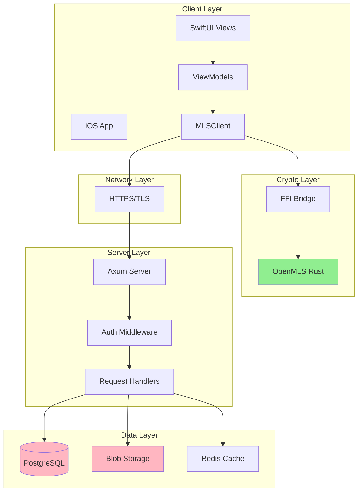
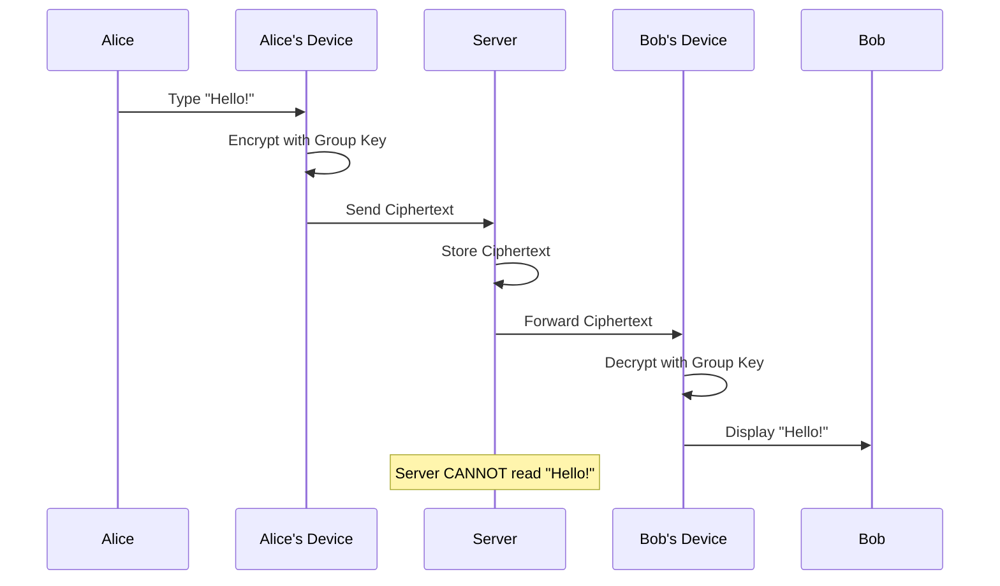
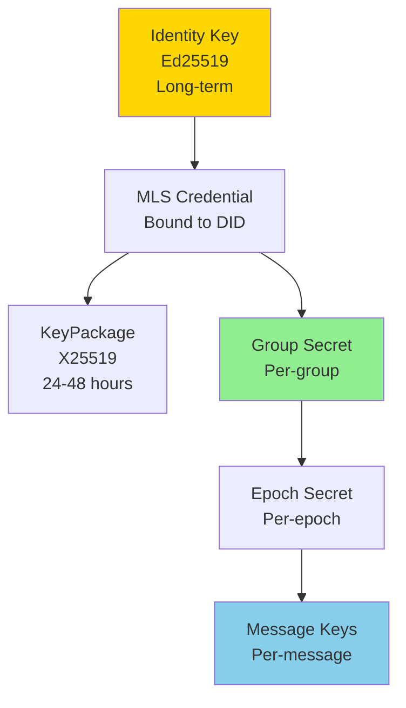
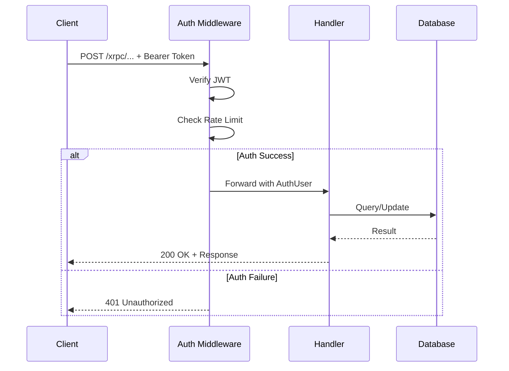
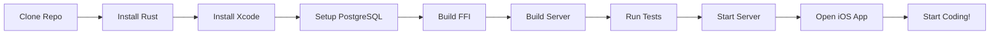
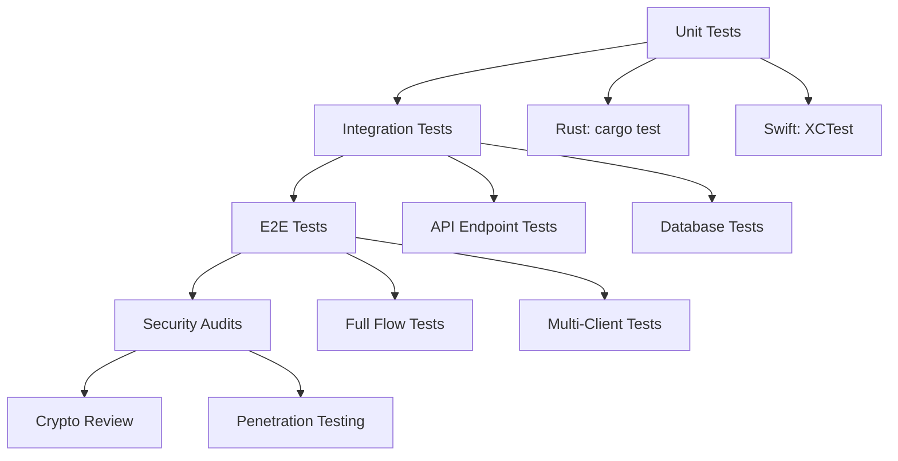
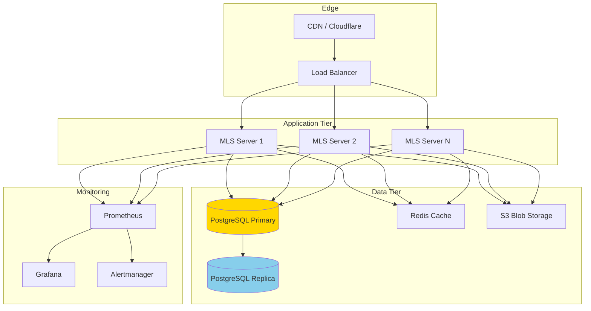
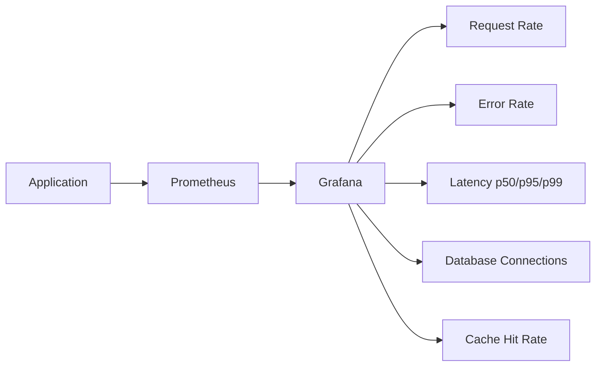
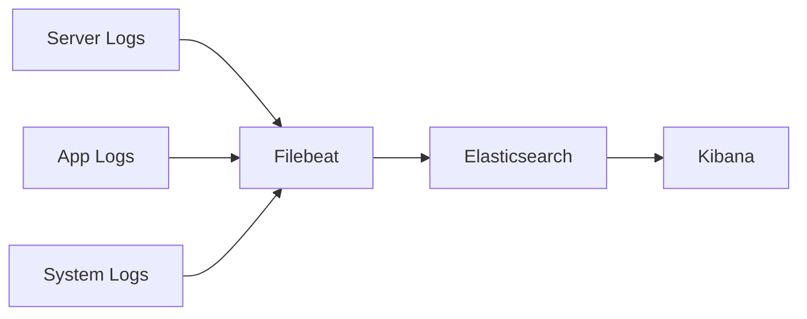

# MLS Chat Documentation

Welcome to the comprehensive documentation for **Catbird MLS Chat** - an end-to-end encrypted group messaging system built on the MLS protocol (RFC 9420) and AT Protocol identity.

---

## 📚 Documentation Overview

### For Users
- **[USER_GUIDE.md](USER_GUIDE.md)** - Complete guide for using MLS Chat
  - Creating and managing groups
  - Understanding E2EE indicators
  - Security best practices
  - Troubleshooting common issues

- **[FAQ.md](FAQ.md)** - Frequently asked questions
  - General questions about MLS
  - Security and privacy concerns
  - Technical details
  - Comparisons with other apps

### For Developers
- **[DEVELOPER_GUIDE.md](DEVELOPER_GUIDE.md)** - Development documentation
  - Architecture overview
  - API reference
  - iOS client development
  - Backend development
  - FFI bridge usage
  - Testing strategies
  - Extending functionality

- **[ARCHITECTURE.md](ARCHITECTURE.md)** - System architecture
  - Component overview
  - Data flow diagrams
  - Technology decisions
  - API endpoints

- **[DEVELOPMENT.md](DEVELOPMENT.md)** - Development workflow
  - Setup instructions
  - Build process
  - Contributing guidelines

### For Administrators
- **[ADMIN_GUIDE.md](ADMIN_GUIDE.md)** - Server operations
  - Deployment options (Docker, bare metal)
  - Database setup and migrations
  - Monitoring and logging
  - Backup and restore
  - Scaling strategies
  - Security hardening

### For Security Teams
- **[SECURITY.md](SECURITY.md)** - Security model and threat analysis
  - Comprehensive threat model
  - Cryptographic primitives
  - Key management
  - Attack surface analysis
  - Privacy considerations
  - Incident response
  - Compliance and auditing

---

## 🏗️ System Architecture

### High-Level Overview



### Component Responsibilities

| Component | Responsibility | Technology |
|-----------|----------------|------------|
| **iOS App** | User interface, local storage | Swift, SwiftUI, SwiftData |
| **MLSClient** | Network communication | URLSession, Codable |
| **FFI Bridge** | Swift-Rust interop | C ABI, cbindgen |
| **OpenMLS** | MLS protocol implementation | Rust, OpenMLS library |
| **Server** | Message routing, persistence | Rust, Axum, PostgreSQL |
| **Auth** | DID verification, JWT | jsonwebtoken, reqwest |

---

## 🔐 Security Model

### End-to-End Encryption Flow



### Key Management



### Threat Model Summary

| Threat | Impact | Mitigation |
|--------|--------|------------|
| **Server Compromise** | 🔴 Metadata exposed<br/>🟢 Content protected | E2EE, ciphertext storage |
| **Device Theft** | 🔴 Past messages exposed<br/>🟢 Future protected | Post-compromise security |
| **Malicious Member** | 🔴 Group messages exposed<br/>🟢 Other groups safe | Authentication, signatures |
| **Network Eavesdrop** | 🟢 No exposure | TLS + MLS double encryption |
| **Quantum Computer** | 🟡 Future risk | Algorithm agility, PQ upgrades |

---

## 📊 API Architecture

### XRPC Endpoints

```mermaid
graph LR
    A[Client] --> B{API Gateway}
    B --> C[/xrpc/blue.catbird.mls.createConvo]
    B --> D[/xrpc/blue.catbird.mls.addMembers]
    B --> E[/xrpc/blue.catbird.mls.sendMessage]
    B --> F[/xrpc/blue.catbird.mls.getMessages]
    B --> G[/xrpc/blue.catbird.mls.publishKeyPackage]
    B --> H[/xrpc/blue.catbird.mls.getKeyPackages]
    B --> I[/xrpc/blue.catbird.mls.leaveConvo]
    B --> J[/xrpc/blue.catbird.mls.uploadBlob]
    
    C --> K[(Database)]
    D --> K
    E --> K
    F --> K
    G --> K
    H --> K
    I --> K
    J --> L[Blob Storage]
```

### Request/Response Flow



---

## 🔧 Development Workflow

### Local Development Setup



### Build Process

```bash
# 1. Build Rust FFI for iOS
cd mls-ffi
cargo build --release --target aarch64-apple-ios
cbindgen --config cbindgen.toml --output ../client-ios/CatbirdChat/MLSBridge.h

# 2. Build server
cd ../server
cargo build --release

# 3. Run migrations
export DATABASE_URL=postgres://localhost/mls_dev
sqlx migrate run

# 4. Run tests
cargo test

# 5. Start server
cargo run
```

### Testing Strategy



---

## 📦 Deployment Architecture

### Production Deployment



### Docker Deployment

```yaml
# docker-compose.yml structure
services:
  db: postgres:15-alpine
  redis: redis:7-alpine
  server: catbird-mls-server:latest
  nginx: nginx:alpine
```

### Scaling Considerations

| Metric | Threshold | Action |
|--------|-----------|--------|
| **CPU** | > 70% | Add server instances |
| **Memory** | > 80% | Increase container limits |
| **DB Connections** | > 90% | Add read replicas |
| **Latency p99** | > 2s | Investigate slow queries |
| **Error Rate** | > 1% | Alert and investigate |

---

## 📈 Monitoring & Observability

### Metrics Dashboard



### Key Metrics

| Metric | Description | Alert Threshold |
|--------|-------------|-----------------|
| `http_requests_total` | Total HTTP requests | N/A (info only) |
| `http_request_duration_seconds` | Request latency | p99 > 2s |
| `database_connections_active` | Active DB connections | > 90 |
| `mls_group_creations_total` | Groups created | N/A (info only) |
| `mls_messages_sent_total` | Messages sent | N/A (info only) |
| `auth_failures_total` | Failed auth attempts | > 100/min |

### Log Aggregation



---

## 🛣️ Development Roadmap

### Phase 1: MVP (Completed)
- ✅ Server infrastructure
- ✅ Basic XRPC endpoints
- ✅ FFI bridge foundation
- ✅ Lexicon definitions

### Phase 2: Core Features (In Progress)
- 🔄 Complete MLS implementation
- 🔄 iOS UI integration
- 🔄 End-to-end testing
- 🔄 Production deployment

### Phase 3: Enhancements (Planned)
- ⏳ Multi-device support
- ⏳ Sealed sender
- ⏳ Message reactions
- ⏳ Read receipts

### Phase 4: Advanced Security (Future)
- ⏳ Post-quantum cryptography
- ⏳ Metadata privacy
- ⏳ Key transparency
- ⏳ Formal verification

---

## 🤝 Contributing

### How to Contribute

1. **Read the docs**: Familiarize yourself with the codebase
2. **Find an issue**: Check [GitHub Issues](https://github.com/catbird/mls/issues)
3. **Fork & branch**: Create a feature branch
4. **Make changes**: Follow coding standards
5. **Test**: Run all tests
6. **Submit PR**: Include detailed description

### Code Style

**Rust:**
```bash
cargo fmt
cargo clippy -- -D warnings
```

**Swift:**
```bash
swiftlint
swiftformat .
```

### Commit Messages

Follow [Conventional Commits](https://www.conventionalcommits.org/):

```
feat: add sealed sender support
fix: resolve epoch mismatch on reconnect
docs: update API reference for addMembers
test: add integration tests for key rotation
```

---

## 📞 Support & Community

### Getting Help

- **Documentation**: Start here!
- **GitHub Discussions**: Ask questions
- **Discord**: Real-time community chat
- **Email**: support@catbird.chat

### Reporting Issues

- **Bugs**: [GitHub Issues](https://github.com/catbird/mls/issues)
- **Security**: security@catbird.chat (use PGP)
- **Feature Requests**: GitHub Discussions

### Community Guidelines

- Be respectful and inclusive
- Help others learn
- Provide constructive feedback
- Follow code of conduct

---

## 📜 License

This project is licensed under the **MIT License** - see [LICENSE](../LICENSE) file.

---

## 🙏 Acknowledgments

- **MLS Working Group** - For the excellent protocol specification
- **OpenMLS Team** - For the Rust implementation
- **Bluesky Team** - For AT Protocol inspiration
- **Catbird Contributors** - For building this with us

---

## 📚 Additional Resources

### Specifications
- [MLS RFC 9420](https://www.rfc-editor.org/rfc/rfc9420.html)
- [AT Protocol](https://atproto.com/)
- [OpenMLS Docs](https://openmls.tech/)

### Research Papers
- [MLS Security Proofs](https://eprint.iacr.org/2019/1019)
- [TreeKEM Analysis](https://eprint.iacr.org/2018/1160)

### Related Projects
- [Signal Protocol](https://signal.org/docs/)
- [Matrix E2EE](https://matrix.org/docs/guides/end-to-end-encryption-implementation-guide)
- [Wire MLS](https://github.com/wireapp/wire-server)

---

**Last Updated**: October 21, 2025  
**Documentation Version**: 1.0  

*For questions or suggestions about this documentation, please open an issue on GitHub.*
