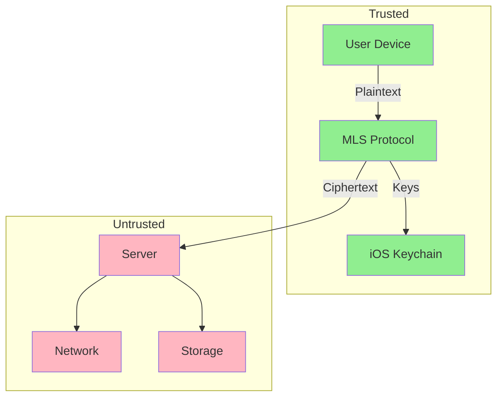
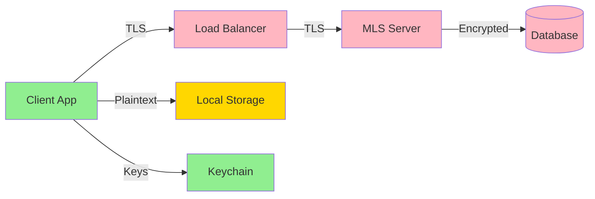
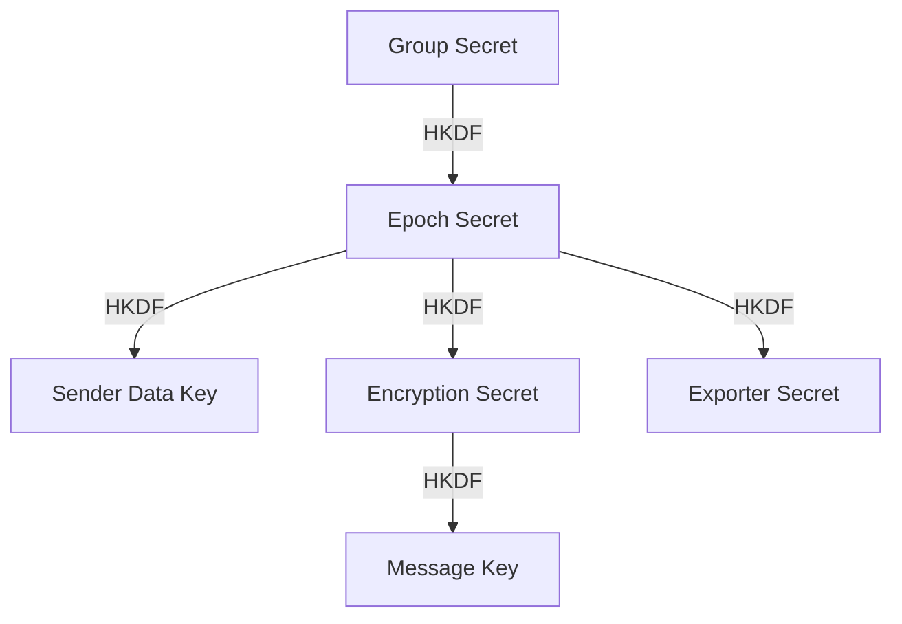

# MLS Chat Security Model & Threat Analysis

**Version**: 1.0  
**Last Updated**: October 21, 2025  
**Audience**: Security Engineers, Auditors, Privacy Advocates

---

## 📖 Table of Contents

1. [Executive Summary](#executive-summary)
2. [Security Architecture](#security-architecture)
3. [Threat Model](#threat-model)
4. [Security Properties](#security-properties)
5. [Cryptographic Primitives](#cryptographic-primitives)
6. [Key Management](#key-management)
7. [Attack Surface Analysis](#attack-surface-analysis)
8. [Privacy Considerations](#privacy-considerations)
9. [Security Best Practices](#security-best-practices)
10. [Incident Response](#incident-response)
11. [Compliance & Auditing](#compliance--auditing)

---

## 📊 Executive Summary

MLS Chat provides **end-to-end encrypted group messaging** using the MLS protocol (RFC 9420). Key security features:

- ✅ **End-to-End Encryption**: Server cannot read message content
- ✅ **Forward Secrecy**: Past messages secure even if current keys compromised
- ✅ **Post-Compromise Security**: Future messages secure after removing compromised member
- ✅ **Authentication**: All messages signed and verified
- ⚠️ **Metadata Exposure**: Server sees participant DIDs, timestamps, sizes
- ⚠️ **Single Device**: No multi-device support (yet)



---

## 🏗️ Security Architecture

### Trust Boundaries



**Trust Levels:**
- 🟢 **Trusted**: Client device, Keychain (assumes physical security)
- 🟡 **Partially Trusted**: Local storage (encrypted at rest by iOS)
- 🔴 **Untrusted**: Server, network, cloud storage

---

### Security Layers

| Layer | Protection | Technology |
|-------|------------|------------|
| **Transport** | Encryption in transit | TLS 1.3 |
| **Content** | End-to-end encryption | MLS (AES-128-GCM) |
| **Authentication** | Identity verification | AT Protocol DIDs + Ed25519 |
| **Key Storage** | Secure key storage | iOS Keychain + Secure Enclave |
| **Local Data** | Encrypted at rest | iOS Data Protection (FileVault) |

---

## 🎯 Threat Model

### Adversary Capabilities

We consider three classes of adversaries:

#### 1. **Network Attacker** (Passive)
- **Capability**: Observes network traffic
- **Goal**: Decrypt messages or infer metadata
- **Mitigation**: TLS 1.3 + MLS E2EE

#### 2. **Server Attacker** (Honest-but-Curious)
- **Capability**: Full access to server and database
- **Goal**: Read message content
- **Mitigation**: All messages stored as ciphertext

#### 3. **Active Attacker** (Malicious Server)
- **Capability**: Modify messages, impersonate users
- **Goal**: Break protocol guarantees
- **Mitigation**: Message authentication, signature verification

---

### Threat Scenarios

#### Threat 1: Server Compromise

**Scenario:** Attacker gains root access to MLS server.

**What attacker can see:**
- ✅ Encrypted message ciphertext
- ✅ Metadata (DIDs, conversation IDs, timestamps)
- ✅ KeyPackages (public keys)
- ❌ **Message plaintext** (requires group keys)
- ❌ **Identity private keys** (stored on client)

**Impact:** 
- 🔴 **High** for metadata privacy
- 🟢 **None** for message content
- 🟢 **None** for past messages (forward secrecy)

**Detection:**
- Server logs show unauthorized access
- Integrity checks fail on modified files

**Response:**
1. Rotate server TLS certificates
2. Force all clients to re-authenticate
3. Audit database for unauthorized queries
4. Notify users of potential metadata exposure

---

#### Threat 2: Client Device Theft

**Scenario:** User's iPhone is stolen while unlocked.

**What attacker can access:**
- ✅ Messages stored locally (plaintext cache)
- ✅ Group state (MLS state)
- ⚠️ Identity keys (if not Face ID protected)
- ❌ **Future messages** (after removal from groups)

**Impact:**
- 🔴 **High** for past messages on device
- 🟢 **None** for future messages (post-compromise security)
- 🟢 **None** for other users' devices

**Detection:**
- User reports device stolen
- Unusual activity from device IP/location

**Response:**
1. User remotely wipes device via Find My iPhone
2. Admin removes user from all groups (advances epochs)
3. User generates new identity keys on new device
4. Admin re-invites user with new DID

---

#### Threat 3: Malicious Group Member

**Scenario:** Insider screenshots and leaks messages.

**What attacker can do:**
- ✅ Read all messages in groups they're in
- ✅ Screenshot and leak content
- ✅ Forward messages to outsiders
- ❌ **Cannot forge messages** (signatures verify sender)
- ❌ **Cannot access other groups**

**Impact:**
- 🔴 **High** for confidentiality within group
- 🟢 **None** for message authentication
- 🟢 **None** for other groups

**Detection:**
- Messages appear publicly (after the fact)
- Forensic analysis of screenshots (watermarking)

**Response:**
1. Remove malicious member from group
2. Social consequences (policy-based)
3. No cryptographic solution (insider threat)

---

#### Threat 4: Network Eavesdropper (MITM)

**Scenario:** Attacker intercepts network traffic.

**What attacker can observe:**
- ✅ Encrypted traffic (TLS ciphertext)
- ✅ Packet sizes and timing
- ❌ **Message content** (TLS + MLS)
- ❌ **Identity keys** (never transmitted)
- ❌ **Group keys** (encrypted in MLS handshake)

**Impact:**
- 🟡 **Low** for metadata inference
- 🟢 **None** for content privacy

**Detection:**
- Certificate pinning detects MITM
- Client rejects invalid TLS certificates

**Response:**
- Client displays certificate warning
- User reports suspicious certificate

---

#### Threat 5: Quantum Computer (Future)

**Scenario:** Adversary records encrypted traffic, decrypts years later with quantum computer.

**What attacker can do:**
- ✅ Break X25519 key exchange → decrypt past traffic
- ✅ Break Ed25519 signatures → forge messages
- ❌ **Cannot decrypt if data not recorded** ("store now, decrypt later")

**Impact:**
- 🔴 **High** (in 10-20 years)
- 🟢 **None** (currently no practical quantum computers)

**Mitigation:**
- Future: Upgrade to post-quantum cipher suites
- MLS supports algorithm agility
- NIST post-quantum algorithms becoming standardized

---

## 🔐 Security Properties

### 1. Confidentiality

**Property:** Message content is secret to group members only.

**Achieved via:**
- AEAD encryption (AES-128-GCM)
- Group key derived from MLS ratchet tree
- Keys never leave client devices

**Verification:**
```rust
// Message encryption (simplified)
let ciphertext = aead.seal(plaintext, group_key, nonce)?;
assert_eq!(server_knows(ciphertext), false);
```

---

### 2. Forward Secrecy (FS)

**Property:** Compromise of current keys does not reveal past messages.

**Achieved via:**
- Ratcheting key derivation (MLS ratchet tree)
- Old keys deleted after epoch advance
- Each epoch uses fresh derived keys

**Example:**
```
Epoch 0: Keys K0 → Message M0 encrypted
Epoch 1: Keys K1 derived from K0, K0 deleted
         → Even with K1, cannot compute K0 → M0 secure
```

**Verification:**
- Attacker with K1 cannot compute K0
- Past ciphertexts remain secure

---

### 3. Post-Compromise Security (PCS)

**Property:** Future messages remain secure after compromise is detected and mitigated.

**Achieved via:**
- Removing compromised member (advances epoch)
- Fresh keys derived without compromised member's input
- Removed member cannot compute new keys

**Example:**
```
Epoch 2: Alice's device compromised
Epoch 3: Admin removes Alice → New keys derived without Alice
         → Alice's old keys cannot compute K3 → M3 secure
```

**Recovery time:** Immediate (next epoch advance)

---

### 4. Authentication

**Property:** Recipients can verify sender identity.

**Achieved via:**
- Ed25519 signatures on all messages
- Credentials bound to AT Protocol DID
- DID verified via DID document

**Verification:**
```rust
let message = decrypt(ciphertext)?;
let sender_did = verify_signature(message.signature, message.payload)?;
assert_eq!(sender_did, expected_did);
```

---

### 5. Integrity

**Property:** Messages cannot be modified without detection.

**Achieved via:**
- AEAD encryption (GCM mode)
- Authentication tags on all ciphertexts
- Signature over message payload

**Verification:**
```rust
match aead.open(ciphertext, group_key, nonce) {
    Ok(plaintext) => // Integrity verified
    Err(_) => // Tampering detected
}
```

---

### 6. Replay Protection

**Property:** Attacker cannot replay old messages.

**Achieved via:**
- Epoch + sequence numbers on all messages
- Clients reject messages from past epochs
- Nonce uniqueness enforced

**Verification:**
```rust
if message.epoch < current_epoch {
    return Err(Error::StaleMessage);
}
```

---

## 🔑 Cryptographic Primitives

### Cipher Suite

**MLS_128_DHKEMX25519_AES128GCM_SHA256_Ed25519**

| Component | Algorithm | Purpose | Security Level |
|-----------|-----------|---------|----------------|
| **KEM** | DHKEM(X25519, HKDF-SHA256) | Key encapsulation | 128-bit |
| **AEAD** | AES-128-GCM | Authenticated encryption | 128-bit |
| **Hash** | SHA-256 | Hashing, key derivation | 128-bit |
| **Signature** | Ed25519 | Message signing | 128-bit |

**Rationale:** 
- Mandatory-to-implement in MLS RFC 9420
- Efficient on mobile devices
- Well-studied and battle-tested

---

### Key Derivation



**HKDF Parameters:**
- Extract: SHA-256
- Expand: SHA-256
- Context: Epoch number + group ID

---

### Nonce Construction

```
nonce = encryption_key_nonce XOR sender_sequence_number
```

**Properties:**
- Unique per message (sequence number)
- Unpredictable (XOR with random nonce)
- Never reused within epoch

---

## 🔐 Key Management

### Identity Keys (Long-Term)

**Type:** Ed25519 key pair  
**Lifetime:** Persistent (tied to DID)  
**Storage:** iOS Keychain (Secure Enclave backed)  
**Usage:** Sign MLS credentials and handshake messages

**Generation:**
```swift
let identityKey = Curve25519.Signing.PrivateKey()
try KeychainService.store(identityKey, for: userDID)
```

**Protection:**
- Keychain access requires device unlock
- Can require Face ID for access
- Backed up to iCloud Keychain (encrypted)

---

### Ephemeral Keys (KeyPackages)

**Type:** X25519 key pair  
**Lifetime:** 24-48 hours  
**Storage:** Encrypted on disk, in-memory during use  
**Usage:** HPKE for Welcome message encryption

**Rotation Policy:**
- Generate fresh KeyPackage after each use (one-time)
- Proactively publish 3-5 KeyPackages
- Expire after 48 hours

**Example:**
```rust
let key_package = KeyPackage::builder()
    .key_package_lifetime(Duration::from_secs(48 * 3600))
    .build()?;
server.publish(key_package).await?;
```

---

### Group Keys (Per-Epoch)

**Type:** Symmetric AES-128 keys  
**Lifetime:** One epoch  
**Storage:** MLS group state (encrypted on disk)  
**Derivation:** MLS ratchet tree

**Security:**
- Derived from group secret + ratchet tree
- Forward secrecy: Old keys deleted after epoch advance
- Post-compromise security: Fresh keys after member removal

---

### Key Hierarchy

```
┌─────────────────┐
│  Identity Key   │ (Long-term, Ed25519)
│  (iOS Keychain) │
└────────┬────────┘
         │ signs
         ▼
┌─────────────────┐
│  MLS Credential │ (Bound to DID)
└────────┬────────┘
         │
         ▼
┌─────────────────┐
│  Group Secret   │ (Per group, derived)
└────────┬────────┘
         │ HKDF
         ▼
┌─────────────────┐
│  Epoch Secret   │ (Per epoch, derived)
└────────┬────────┘
         │ HKDF
         ▼
┌─────────────────┐
│  Message Keys   │ (Per message, derived)
└─────────────────┘
```

---

## 🛡️ Attack Surface Analysis

### Client-Side

| Component | Attack Vector | Mitigation |
|-----------|---------------|------------|
| **iOS App** | Code injection, memory corruption | Sandboxing, ASLR, DEP |
| **FFI Bridge** | Buffer overflow, use-after-free | Safe Rust, memory safety |
| **Keychain** | Brute force, malware | Secure Enclave, device passcode |
| **Local DB** | SQL injection, data extraction | Parameterized queries, encryption at rest |

---

### Server-Side

| Component | Attack Vector | Mitigation |
|-----------|---------------|------------|
| **HTTP Server** | DDoS, request smuggling | Rate limiting, reverse proxy |
| **Auth Layer** | JWT forgery, replay | HMAC verification, expiry |
| **Database** | SQL injection, data breach | Parameterized queries, principle of least privilege |
| **Blob Storage** | Unauthorized access | Access control, signed URLs |

---

### Network

| Attack Vector | Mitigation |
|---------------|------------|
| **Eavesdropping** | TLS 1.3 encryption |
| **MITM** | Certificate pinning |
| **Traffic Analysis** | (Future: Padding, dummy traffic) |
| **DDoS** | CDN, rate limiting |

---

## 🕵️ Privacy Considerations

### What's Private (E2EE)

✅ **Message Content**  
✅ **Attachments**  
✅ **Group Name** (if set by creator)  
✅ **Participant Nicknames**

### What's Visible to Server

⚠️ **Participant DIDs**  
⚠️ **Message Timestamps**  
⚠️ **Message Sizes**  
⚠️ **Conversation IDs**  
⚠️ **Epoch Numbers**  
⚠️ **IP Addresses** (transient)

### Metadata Mitigation Strategies

**Current:**
- Conversation IDs are random UUIDs (no semantic meaning)
- DIDs are not published to public AT Protocol network
- Server logs use truncated/hashed identifiers

**Future Enhancements:**
- **Sealed Sender**: Hide sender from server
- **Padding**: Uniform message sizes
- **Dummy Traffic**: Send fake messages
- **Onion Routing**: Mix networks for metadata privacy

---

## 🛠️ Security Best Practices

### For Users

1. **Enable Device Security**
   - Set strong iOS passcode (6+ digits)
   - Enable Face ID / Touch ID
   - Enable "Erase Data after 10 attempts"

2. **Verify Member Identities**
   - Check DIDs out-of-band before sharing sensitive info
   - Be wary of DID changes (could indicate compromise)

3. **Key Rotation**
   - Keep app open at least once every 2 days (auto-publishes KeyPackages)
   - Check for "KeyPackage expired" warnings

4. **Compromise Response**
   - Report stolen devices immediately
   - Have admin remove you from all groups
   - Generate new identity keys

5. **Backup Wisely**
   - Enable iCloud Keychain (encrypted backup)
   - Understand that backups may reduce security (stored in cloud)

---

### For Developers

1. **Never Log Secrets**
   ```rust
   // ❌ Bad
   tracing::info!("User password: {}", password);
   
   // ✅ Good
   tracing::info!("User authenticated: {}", user_did_hash);
   ```

2. **Validate All Inputs**
   ```rust
   if epoch < 0 || epoch > MAX_EPOCH {
       return Err(Error::InvalidEpoch);
   }
   ```

3. **Use Constant-Time Comparisons**
   ```rust
   use subtle::ConstantTimeEq;
   
   if mac.ct_eq(&computed_mac).unwrap_u8() == 1 {
       // Verified
   }
   ```

4. **Clear Sensitive Data**
   ```rust
   let mut key = get_key();
   // ... use key
   key.zeroize(); // Overwrite with zeros
   ```

5. **Audit Dependencies**
   ```bash
   cargo audit
   cargo outdated
   ```

---

### For Administrators

1. **Harden Server**
   - Disable root login
   - Use SSH keys (no passwords)
   - Enable firewall (UFW)
   - Keep OS and packages updated

2. **Monitor Logs**
   - Set up alerts for suspicious patterns
   - Review failed authentication attempts
   - Check for unusual traffic spikes

3. **Database Security**
   - Use strong passwords (32+ characters)
   - Restrict database access to localhost only
   - Enable TLS for database connections
   - Regular backups (encrypted)

4. **TLS Configuration**
   - Use Let's Encrypt for automatic renewal
   - Enable HSTS
   - Disable TLS 1.0, 1.1
   - Use strong cipher suites only

5. **Incident Response Plan**
   - Document breach response procedures
   - Maintain contact list for security notifications
   - Test restore procedures regularly

---

## 🚨 Incident Response

### Security Incident Types

1. **Server Compromise**
2. **Client Device Theft**
3. **Key Compromise**
4. **Data Breach**
5. **DDoS Attack**

---

### Response Procedure

#### 1. Detection

**Indicators:**
- Unusual server activity (CPU, network)
- Failed authentication attempts
- User reports suspicious behavior
- Integrity check failures

**Monitoring:**
```bash
# Check for unauthorized logins
sudo last -a | grep -v "known_ips"

# Check running processes
ps aux | grep -v "known_processes"

# Check open ports
netstat -tulpn
```

---

#### 2. Containment

**Immediate Actions:**
- Isolate affected systems (firewall rules)
- Revoke compromised credentials
- Enable debug logging
- Snapshot systems for forensics

**Example:**
```bash
# Block suspicious IP
sudo ufw deny from 203.0.113.42

# Revoke JWT tokens
redis-cli FLUSHDB

# Take snapshot
sudo lvcreate -L 10G -s -n mls-forensics /dev/vg0/mls-root
```

---

#### 3. Investigation

**Gather Evidence:**
- Server logs: `/var/log/catbird-mls/`
- Database logs: `/var/log/postgresql/`
- Access logs: `/var/log/nginx/access.log`
- System logs: `journalctl -u catbird-mls`

**Analyze:**
```bash
# Find unauthorized database queries
sudo grep -i "SELECT.*messages" /var/log/postgresql/postgresql.log | \
  grep -v "known_queries"

# Check for modified files
sudo debsums -c
```

---

#### 4. Notification

**Internal:**
- Notify security team immediately
- Brief executive team within 2 hours

**External:**
- Notify affected users within 72 hours (GDPR)
- Disclose metadata exposure (not content, due to E2EE)

**Template:**
```
Subject: Security Incident Notification

Dear Catbird MLS Users,

On [DATE], we detected unauthorized access to our MLS server infrastructure.

Impact:
- Message content: NOT COMPROMISED (E2EE protected)
- Metadata: POTENTIALLY EXPOSED (DIDs, timestamps, conversation IDs)
- Identity keys: NOT COMPROMISED (stored on your device)

Actions Taken:
- Server isolated and forensics ongoing
- All authentication tokens revoked
- Database integrity verified

Actions Required:
- Re-authenticate in the app
- Verify group memberships
- Report suspicious activity

We apologize for this incident and are committed to transparency.

- Catbird Security Team
```

---

#### 5. Recovery

**Steps:**
1. Patch vulnerabilities
2. Restore from clean backups (if needed)
3. Rotate server secrets (JWT keys, TLS certs)
4. Force all clients to re-authenticate
5. Audit all administrative actions

**Verification:**
```bash
# Verify no backdoors
sudo rkhunter --check
sudo chkrootkit

# Verify integrity
sudo aide --check
```

---

#### 6. Post-Mortem

**Document:**
- Timeline of events
- Root cause analysis
- Impact assessment
- Lessons learned
- Preventive measures

**Improve:**
- Update incident response plan
- Implement additional monitoring
- Conduct security training
- Consider third-party audit

---

## 📋 Compliance & Auditing

### GDPR Compliance

**Data Controller:** MLS server operator  
**Data Processors:** Cloud providers (if used)

**User Rights:**
1. **Right to Access**: Users can request metadata (DIDs, timestamps)
2. **Right to Erasure**: Users can delete conversations (ciphertext removed)
3. **Right to Portability**: Users can export group lists (not message content, due to E2EE)
4. **Right to Rectification**: Users can update DID (re-publish KeyPackages)

**Data Retention:**
- Messages: Configurable (default: 90 days)
- KeyPackages: 48 hours (auto-expire)
- Logs: 30 days
- Backups: 30 days

---

### Security Audits

**Recommended Frequency:**
- **Internal Code Review**: Every release
- **Penetration Testing**: Annually
- **Third-Party Audit**: Every 2 years
- **Cryptographic Review**: Before major version

**Audit Scope:**
- MLS protocol implementation (FFI layer)
- Server API endpoints
- Authentication and authorization
- Key management
- Logging and monitoring

---

### Security Certifications

**Current:** None (early stage)

**Future:**
- SOC 2 Type II (Service Organization Control)
- ISO 27001 (Information Security Management)
- FIPS 140-2 (Cryptographic Module Validation) - for FFI layer

---

## 🔮 Future Security Enhancements

### Planned (6-12 months)

- [ ] **Sealed Sender**: Hide sender DID from server
- [ ] **Multi-Device Support**: Sync across devices securely
- [ ] **Key Transparency**: Public log of KeyPackages (detect impersonation)
- [ ] **PSK-Based Recovery**: Recover group access after device loss

### Under Consideration (12+ months)

- [ ] **Post-Quantum Cryptography**: Upgrade to PQ-safe algorithms
- [ ] **Onion Routing**: Metadata privacy via mix networks
- [ ] **Message Deniability**: Plausible deniability for messages
- [ ] **Ephemeral Messages**: Auto-delete after time period

---

## 📚 References

### Standards

- **[RFC 9420: MLS Protocol](https://www.rfc-editor.org/rfc/rfc9420.html)**
- **[RFC 9420: Architecture](https://www.rfc-editor.org/rfc/rfc9420.html)**
- **[AT Protocol Specs](https://atproto.com/specs)**

### Implementations

- **[OpenMLS](https://openmls.tech/)** - Rust MLS library
- **[MLS Implementations List](https://github.com/mlswg/mls-implementations)**

### Security Analysis

- **[MLS Security Proofs](https://eprint.iacr.org/2019/1019)** - Formal analysis
- **[TreeKEM Analysis](https://eprint.iacr.org/2018/1160)** - Ratchet tree security

---

## 📞 Security Contact

**Report vulnerabilities:** security@catbird.chat  
**PGP Key:** Available at https://catbird.chat/.well-known/pgp-key.txt  
**Bug Bounty:** Contact for details

**Please do NOT publicly disclose vulnerabilities without coordinated disclosure.**

---

## 📝 Changelog

- **2025-10-21**: Initial security documentation (v1.0)

---

**This document is living and will be updated as the system evolves.**
