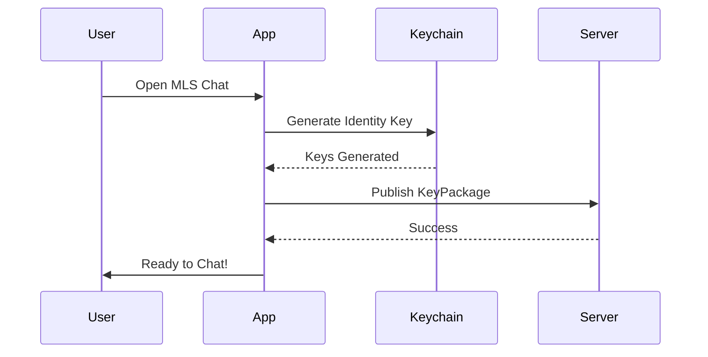
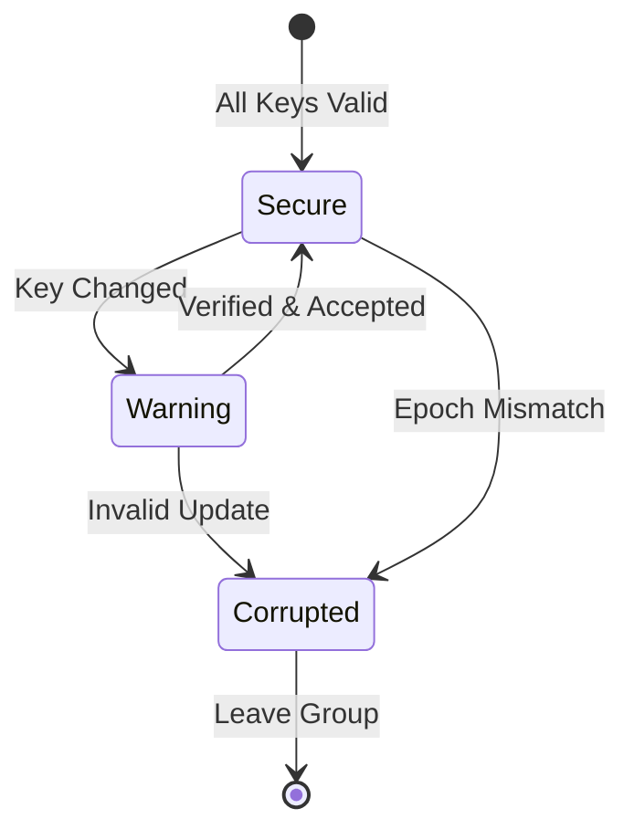
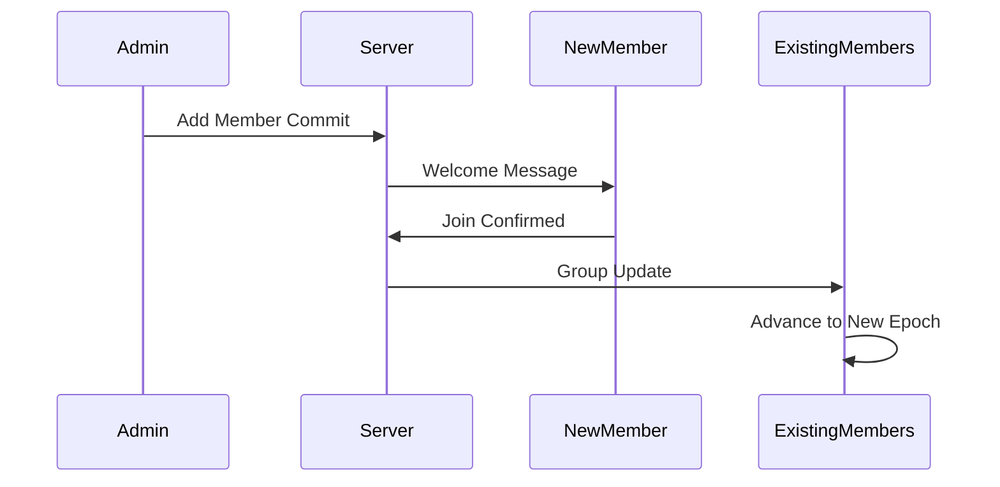

# MLS Chat User Guide

**Version**: 1.0  
**Last Updated**: October 21, 2025  
**For**: Catbird iOS App Users

---

## 📱 What is MLS Chat?

MLS Chat is a **private, end-to-end encrypted group messaging** feature in Catbird. Unlike regular Bluesky direct messages, MLS conversations are:

- 🔐 **End-to-end encrypted** - Only participants can read messages
- 🛡️ **Forward secure** - Compromised keys don't reveal past messages  
- 🔒 **Post-compromise secure** - Removing a member revokes their future access
- 🏠 **Self-hostable** - You control your data
- 👥 **Group-focused** - Built for secure group conversations

---

## 🚀 Getting Started

### Prerequisites

1. **Catbird App** installed on iOS 16.0+
2. **AT Protocol Account** (Bluesky DID)
3. **Network Connection** to an MLS server

### First Launch

When you first open MLS Chat:

1. The app will generate your **identity keys** (stored in iOS Keychain)
2. You'll be prompted to **publish your KeyPackage** (public keys others use to add you)
3. Your DID will be verified with your AT Protocol account

---

## 💬 Using MLS Chat

### Creating a Group Conversation

1. Tap the **"+"** button in MLS Chat
2. Enter a **group name** (optional)
3. Select **members** from your contacts
4. Tap **"Create"**

**What happens behind the scenes:**
- The app fetches KeyPackages for each invited member
- Creates an MLS group with you as the initial member
- Sends Welcome messages to all invitees
- Each member processes the Welcome and joins the group

#### Group Creation Tips

✅ **Do:**
- Choose descriptive group names
- Verify member DIDs before inviting
- Wait for all members to join before sending sensitive messages

❌ **Don't:**
- Add too many members (recommended max: 50)
- Create groups for single recipients (just send a DM)
- Reuse group names (each is unique by ID)

---

### Understanding E2EE Indicators

MLS Chat shows several security indicators:

#### 🔒 **Locked Padlock** (Green)
- Group is **end-to-end encrypted**
- All members have verified keys
- Messages are secure

#### ⚠️ **Warning Triangle** (Yellow)
- A member's key has **changed** (e.g., new device)
- Review member list and verify identities
- You may want to remove and re-add the member

#### ❌ **Red X** (Red)
- Group state is **corrupted** or out-of-sync
- Cannot send/receive messages
- Action required: Leave and rejoin, or create new group

#### 🔄 **Syncing Icon** (Blue)
- Group is **processing an update** (add/remove member)
- Wait for sync to complete
- Don't send messages during sync

---

### Sending Messages

1. Open a group conversation
2. Type your message in the text field
3. Tap **Send**

**Behind the scenes:**
- Message is encrypted with the current group key
- Ciphertext is uploaded to the server
- Server routes to all members
- Each member decrypts with their group key

#### Message Types

| Type | Description | Example |
|------|-------------|---------|
| **Text** | Plain text messages | "Hello, team!" |
| **Attachments** | Photos, videos, files | 📎 image.jpg |
| **Links** | URLs (preview not encrypted) | https://example.com |
| **Replies** | Quote previous message | "Re: your question..." |

**Attachment Encryption:**
- Files are encrypted **client-side** before upload
- Server stores only ciphertext blobs
- Decryption key shared in encrypted message payload

---

### Adding Members to a Group

1. Open group conversation
2. Tap **group info** (⓵ icon)
3. Tap **"Add Members"**
4. Select users
5. Confirm

**Security Note:** Adding a member creates a **new epoch** with new group keys. Past messages are **not** shared with new members.

---

### Removing Members (or Leaving)

#### To Remove a Member (Admin Only):
1. Open group info
2. Long-press on member
3. Tap **"Remove"**
4. Confirm

#### To Leave a Group:
1. Open group info
2. Tap **"Leave Group"**
3. Confirm (action is irreversible)

**Security:** Removal triggers a new epoch. The removed member **cannot decrypt future messages** (post-compromise security).

---

### Reading Messages

Messages appear in chronological order with:
- **Sender's DID** or display name
- **Timestamp**
- **Read receipts** (if enabled)
- **Encryption indicator** (🔒)

#### Message States

| Icon | State | Meaning |
|------|-------|---------|
| 🕐 | Sending | Encrypting and uploading |
| ✓ | Sent | Server received ciphertext |
| ✓✓ | Delivered | All members downloaded |
| 👁️ | Read | Member opened message |
| ⚠️ | Failed | Retry or check connection |

---

## 🔐 Security Best Practices

### Verifying Members

Before sharing sensitive information:

1. **Check DIDs**: Tap on a member to see their full DID
2. **Verify out-of-band**: Confirm DIDs via another channel (phone, in-person)
3. **Look for warnings**: Yellow ⚠️ icons mean keys changed

### Key Rotation

Your KeyPackages expire after **24-48 hours**. The app automatically:
- Generates new KeyPackages
- Publishes them to the server
- Removes expired ones

**What you should do:**
- Keep the app open at least once every 2 days
- Check for "KeyPackage Expired" warnings
- Re-publish if needed (Settings → MLS → Refresh Keys)

### Handling Compromises

If you believe your device is compromised:

1. **Remove yourself** from all groups
2. **Revoke your KeyPackages** (Settings → Security)
3. **Generate new identity keys** (requires new DID setup)
4. **Notify group admins** via another channel

**Others will need to:**
- Remove your old DID from groups
- Invite your new DID

---

## 🔧 Troubleshooting

### "Cannot send message: Epoch mismatch"

**Cause:** Your group state is out of sync.

**Solution:**
1. Pull down to refresh
2. Wait for group update to process
3. If still fails, leave and ask to be re-added

---

### "No KeyPackages available for [DID]"

**Cause:** The user hasn't published recent KeyPackages.

**Solution:**
1. Ask the user to open their app and let it sync
2. Wait 30 seconds and retry
3. Check their DID is correct

---

### "Group state corrupted"

**Cause:** Local database inconsistency.

**Solution:**
1. Export any critical messages (screenshots)
2. Leave the group
3. Ask admin to re-invite you
4. If persists, reinstall app (⚠️ loses all groups)

---

### "Message decryption failed"

**Cause:** Missing keys or corrupted ciphertext.

**Solution:**
- Check you're on the latest epoch (pull to refresh)
- If multiple messages fail, leave and rejoin
- Report to admin if widespread issue

---

### "Connection timeout"

**Cause:** Server unreachable or network issue.

**Solution:**
1. Check internet connection
2. Verify server status (Settings → MLS → Server Health)
3. Try again in 30 seconds
4. Contact server admin if persistent

---

## ⚙️ Settings & Configuration

### MLS Chat Settings

Access via **Settings → MLS Chat**:

| Setting | Options | Description |
|---------|---------|-------------|
| **Server URL** | Custom URL | MLS server endpoint |
| **Auto KeyPackage Refresh** | On/Off | Auto-publish new KeyPackages |
| **KeyPackage Lifetime** | 1-7 days | How long keys are valid |
| **Show Read Receipts** | On/Off | Let others see when you read |
| **Epoch Notifications** | On/Off | Alert on group updates |
| **Backup Group State** | On/Off | iCloud backup (encrypted) |

### Privacy Settings

| Setting | Recommended | Why |
|---------|-------------|-----|
| **Hide Typing Indicators** | Off | Small metadata leak |
| **Disable Link Previews** | On | Prevents server seeing URLs |
| **Clear Inactive Groups** | 30 days | Reduces data footprint |
| **Require Face ID** | On | Protect local messages |

---

## 📊 Understanding Metadata

### What's Private (E2EE):
- ✅ Message content
- ✅ Attachment files
- ✅ Group name (if set by creator)
- ✅ Member nicknames

### What's Visible to Server:
- ⚠️ Your DID
- ⚠️ Group members' DIDs
- ⚠️ Message timestamps
- ⚠️ Message sizes
- ⚠️ Epoch numbers
- ⚠️ Conversation IDs (UUIDs)

**Why?** The server needs this metadata to route messages. This is standard for E2EE systems (even Signal shows metadata).

---

## 🆘 Getting Help

### In-App Support
- Tap **Settings → Help → MLS Chat**
- View FAQ and tutorials

### Community
- **Forum**: https://discuss.catbird.chat
- **Discord**: Catbird Community Server
- **Email**: support@catbird.chat

### Reporting Bugs
1. Go to **Settings → Help → Report Issue**
2. Describe the problem
3. Include screenshots (redact DIDs!)
4. Send logs (automatically redacted)

---

## 🔍 FAQ Quick Links

See **[FAQ.md](FAQ.md)** for detailed answers:

- How is MLS different from Signal?
- Can I use MLS with multiple devices?
- What happens if I lose my phone?
- How do I export group history?
- Can the server read my messages?
- What's the maximum group size?

---

## 📚 Learn More

- **[SECURITY.md](SECURITY.md)** - Deep dive into threat model
- **[DEVELOPER_GUIDE.md](DEVELOPER_GUIDE.md)** - For developers
- **[ADMIN_GUIDE.md](ADMIN_GUIDE.md)** - For server operators
- **MLS RFC 9420**: https://www.rfc-editor.org/rfc/rfc9420.html

---

**Happy Secure Chatting!** 🔐✨
