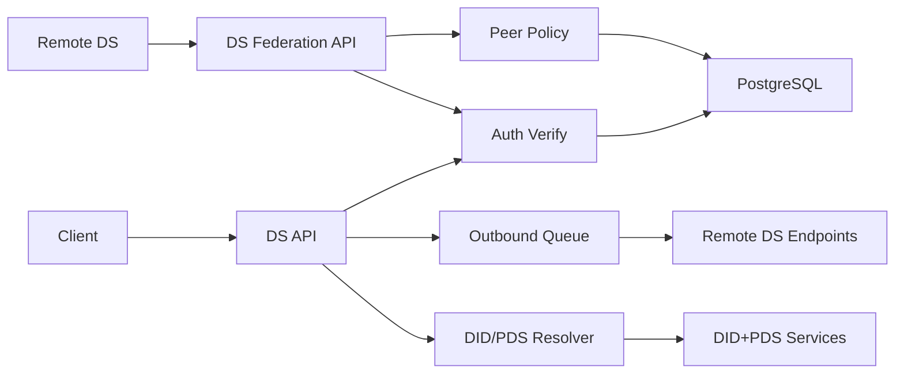

## Assumption Validation Check-in
- Assumption: `server` is internet-exposed via `/xrpc/*` and receives both user-scoped and DS-scoped requests.
- Assumption: DS federation trust is open by default unless explicit policy (`federation_peers`) blocks/suspends peers.
- Assumption: MLS cryptography validates message/commit integrity in clients; DS transport controls primarily protect availability and abuse resistance.
- Assumption: PostgreSQL is the source of truth for conversation membership, sequencer assignment, key packages, and federation policy.
- Assumption: Health check endpoint is intentionally public metadata.

Questions to refine future risk ranking:
1. Should federation be open by default in production, or allowlist-only?
2. Is multi-node deployment expected for DS ingress (affects replay/rate-limit storage strategy)?
3. Are remote DSes expected to fetch key packages without `convoId` (legacy compatibility), or can this be made strict?

No additional answers were provided in this turn; the report below uses explicit assumptions above.

## Executive summary
Primary risk is malicious or compromised DS peers abusing federation endpoints to consume resources or inject unauthorized transport events. The highest-risk paths were DS endpoint auth gaps (issuer/payload mismatch, missing sequencer binding, unrestricted key package fetch) and SSRF/transport policy gaps in resolver code. Current hardening significantly improves fail-closed DS auth, sequencer authorization, peer policy/rate controls, and resolver safety.

## Scope and assumptions
In-scope paths:
- `server/src/auth.rs`
- `server/src/handlers/ds/*`
- `server/src/federation/*`
- `server/src/middleware/rate_limit.rs`
- `server/src/main.rs`
- `server/migrations/*federation*`, `server/migrations/*jti*`

Out-of-scope:
- Client MLS implementation details and cryptographic correctness proofs
- Infrastructure/WAF/CDN protections not represented in repo
- CI/CD and deployment pipeline hardening beyond runtime code paths

Open questions that would materially affect ranking:
- Whether federation should be permissioned by default
- Operational scale and expected DS traffic profiles
- Cross-region/multi-node deployment and cache consistency requirements

## System model
### Primary components
- Axum server routing user endpoints and DS federation endpoints (`server/src/main.rs`).
- Auth middleware/verifier (JWT + DID resolution) (`server/src/auth.rs`).
- DS handlers for `deliverMessage`, `deliverWelcome`, `submitCommit`, `fetchKeyPackage`, `transferSequencer` (`server/src/handlers/ds/*`).
- Federation components: resolver, outbound client/queue, sequencer, transfer (`server/src/federation/*`).
- PostgreSQL tables for conversations/members/messages/key packages/queue and federation policy (`server/migrations/*.sql`).

### Data flows and trust boundaries
- Internet client -> API DS (`/xrpc/blue.catbird.mls*`): user JWT over HTTPS, with auth/rate checks and DB-backed authorization.
- Remote DS -> Federation DS (`/xrpc/blue.catbird.mls.ds.*`): DS service JWT over HTTPS, lxm/jti enforcement, peer policy/rate checks, sequencer/member authorization.
- DS -> PostgreSQL: conversation/membership/sequencer lookups, key package consumption, replay nonce storage, peer policy updates.
- Sequencer DS -> Remote DSes: outbound signed DS calls via queue/retry, endpoint resolution/caching.
- DS -> External DID/PDS resolution: resolver fetches DID docs and profile records with SSRF protections and host validation.

#### Diagram

## Assets and security objectives
| Asset | Why it matters | Security objective (C/I/A) |
|---|---|---|
| Conversation sequencer binding (`conversations.sequencer_ds`) | Prevents unauthorized DS ordering/injection | I, A |
| MLS message stream (`messages`, `commits`) | Message integrity/order and replay resistance | I, A |
| Key package inventory (`key_packages`) | Prevents key-package draining and onboarding abuse | A, I |
| DS service JWT claims (`iss/aud/lxm/jti`) | Identity/authz boundary for federation endpoints | I |
| Replay nonce store (`auth_jti_nonce`) | Prevents token replay across nodes | I, A |
| Federation peer policy (`federation_peers`) | Trust governance and abuse response | I, A |
| DS endpoint resolver cache (`ds_endpoints`) | Prevent SSRF and malicious endpoint poisoning | C, I, A |

## Attacker model
### Capabilities
- Remote attacker can send unauthenticated traffic to public endpoints.
- Malicious DS can obtain valid DS credentials for its own DID and send high-volume authenticated DS requests.
- Attacker can attempt replay, endpoint spoofing, and resolver abuse through crafted DID/profile data.

### Non-capabilities
- Attacker cannot forge valid MLS sender signatures without member keys.
- Attacker cannot directly modify trusted DB state without server/API vulnerabilities.
- Attacker cannot bypass TLS assumptions by default policy unless operators explicitly allow insecure HTTP.

## Entry points and attack surfaces
| Surface | How reached | Trust boundary | Notes | Evidence (repo path / symbol) |
|---|---|---|---|---|
| `deliverMessage` | Remote DS POST | Peer DS -> Federation API | Must be sequencer-bound and issuer-bound | `server/src/handlers/ds/deliver_message.rs` |
| `deliverWelcome` | Remote DS POST | Peer DS -> Federation API | Welcome injection and recipient targeting | `server/src/handlers/ds/deliver_welcome.rs` |
| `submitCommit` | Remote DS POST | Peer DS -> Federation API | Commit ordering and participant authorization | `server/src/handlers/ds/submit_commit.rs` |
| `fetchKeyPackage` | Remote DS GET | Peer DS -> Federation API | Potential package draining without convo binding | `server/src/handlers/ds/fetch_key_package.rs` |
| Resolver DID/PDS fetch | Internal outbound HTTP | DS -> External services | SSRF/host resolution abuse risk | `server/src/federation/resolver.rs` |
| Outbound queue delivery | Internal worker | DS -> Remote DS | Method/payload confusion and endpoint resolution | `server/src/federation/queue.rs`, `server/src/handlers/send_message.rs` |
| Auth extraction | All authenticated requests | Request -> Auth middleware | DS fail-closed auth and replay logic | `server/src/auth.rs` |

## Top abuse paths
1. Unauthorized DS message injection: attacker DS with valid credentials sends `deliverMessage` for known convo -> sequencer mismatch check missing -> bogus transport events stored -> recipient CPU/storage burn.
2. DS identity spoof in payload: attacker DS sends `senderDsDid` of trusted DS while signing as itself -> downstream logs/logic misattribute source -> trust confusion and abuse masking.
3. Key package draining: attacker DS repeatedly calls `fetchKeyPackage` for local users without conversation relationship -> consumes package pool -> onboarding/rejoin failures.
4. Resolver SSRF pivot: crafted DID/profile points to internal host/private IP -> DS fetches internal resources -> metadata leak or service reachability abuse.
5. JWT replay across nodes: stolen short-lived DS token replayed against different nodes if nonce state is local only -> duplicated accepted requests.
6. Federation flood by malicious but authenticated DS: high-rate endpoint calls consume DB/CPU -> partial DS denial-of-service.
7. Outbound method confusion: wrong NSID/payload in queue causes failed or misrouted federation delivery -> reliability and integrity assumptions break.

## Threat model table
| Threat ID | Threat source | Prerequisites | Threat action | Impact | Impacted assets | Existing controls (evidence) | Gaps | Recommended mitigations | Detection ideas | Likelihood | Impact severity | Priority |
|---|---|---|---|---|---|---|---|---|---|---|---|---|
| TM-001 | Malicious DS peer | Valid DS auth for attacker DID | Send `deliverMessage` for convo not sequenced by attacker | Unauthorized transport injection + DoS | Sequencer binding, message stream | DS JWT verification + lxm/jti (`server/src/auth.rs`) | Missing sequencer check in handler (historical) | Enforce `iss == expected sequencer_ds` per convo | Alert on auth failures with sequencer mismatch reason | High | High | high |
| TM-002 | Malicious DS peer | Valid DS auth | Spoof `senderDsDid` in payload | Source spoofing and policy bypass attempts | DS identity integrity | JWT `iss` validation | Payload identity not bound (historical) | Require `senderDsDid == claims.iss` for DS write endpoints | Metric: payload/issuer mismatch count by DS | Medium | High | high |
| TM-003 | Malicious DS peer | Authenticated DS access | Fetch key packages for unrelated recipients | Key package depletion / join failures | Key package availability | Authenticated DS endpoint | No conversation/relationship auth (historical) | Require convo or shared-membership authorization | Track key-package fetch by DS DID + recipient | High | High | high |
| TM-004 | External attacker via DID/profile control | Resolver follows attacker-controlled URLs | Target private/internal addresses | SSRF / internal network probing | Resolver, internal network metadata | Basic host blocking | Missing DNS-to-private-IP validation and HTTP policy | Validate resolved IPs and enforce HTTPS-by-default | Alert on resolver rejections for private/localhost hosts | Medium | High | high |
| TM-005 | Replay attacker | Captured DS JWT within TTL | Replay same token across nodes | Duplicate accepted requests | Auth boundary, availability | In-memory jti cache | Multi-node replay gap (historical) | Shared nonce store with TTL (DB/Redis) | Monitor duplicate jti insert conflicts | Medium | Medium | medium |
| TM-006 | Malicious DS peer | Valid DS auth | High-rate federation endpoint abuse | Resource exhaustion | DS availability | Generic DID/IP rate limiting | No DS-specific policy/quotas (historical) | DS-specific limiter + peer policy overrides | Alert on DS 429 rate and rejected counts | High | Medium | high |
| TM-007 | Logic/config drift | Federation enqueue path active | Wrong method/payload/endpoint in queue | Delivery failures and security assumption mismatch | Outbound queue integrity | Retry queue framework | Wrong NSID/payload wiring (historical) | Use `ds.deliverMessage` payload and endpoint resolution fallback | Queue failure reason dashboards by method | Medium | Medium | medium |

## Criticality calibration
- critical: pre-auth code execution, cross-tenant data exfiltration, or cryptographic key compromise.
  Examples: arbitrary SQL execution in DS handlers; private key exposure; auth bypass allowing arbitrary conversation takeover.
- high: authenticated abuse that breaks message integrity/availability at scale.
  Examples: sequencer impersonation, unrestricted key-package draining, SSRF to internal metadata services.
- medium: constrained abuse requiring additional conditions or causing recoverable disruption.
  Examples: replay attempts mitigated by short TTL; outbound queue misrouting with retry/fallback.
- low: low-sensitivity metadata leaks or noisy, easily mitigated issues.
  Examples: public health metadata exposure; non-security logging hygiene issues.

## Focus paths for security review
| Path | Why it matters | Related Threat IDs |
|---|---|---|
| `server/src/auth.rs` | Core JWT verification, lxm/jti enforcement, replay state logic | TM-001, TM-002, TM-005 |
| `server/src/handlers/ds/deliver_message.rs` | Sequencer authorization and DS payload binding | TM-001, TM-002 |
| `server/src/handlers/ds/fetch_key_package.rs` | Key package authorization boundary | TM-003 |
| `server/src/federation/resolver.rs` | External URL resolution and SSRF controls | TM-004 |
| `server/src/middleware/rate_limit.rs` | DS quota enforcement and abuse throttling | TM-006 |
| `server/src/federation/peer_policy.rs` | Allow/block/suspend trust policy and behavior scoring | TM-006 |
| `server/src/handlers/send_message.rs` | Federation enqueue payload/method integrity | TM-007 |
| `server/src/federation/queue.rs` | Outbound delivery resolution/retry correctness | TM-007 |
| `server/src/handlers/ds/submit_commit.rs` | Commit submission authorization and participant checks | TM-001 |
| `server/src/main.rs` | Worker startup, cleanup, and operational controls | TM-005, TM-006 |
